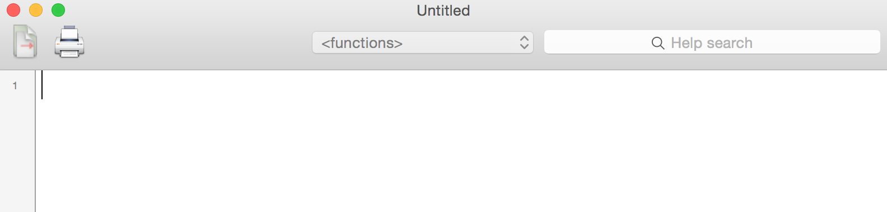

# Why you want to do it: 

Programming languages are powerful for biological data analysis because they allow you to document your work.  Your programming work is saved in a small text-based file (e.g. a script) as a series of commands, like a "data analysis recipe".  This documents your workflow, making your work transparent, reproducible and transferable to other projects.   Some benefits of documenting your work in a programming language include:

* reduces the number of errors in your analysis
* easier to find errors when they do occur
* allows you to rerun your analysis when data or decisions get updated
* allows you to reuse your work, transferring analysis to new projects
* allows others to follow and trust your work

# How you can do it: 


## Scripts in R


An R Script is just a text file with a "`.R`" extension.  We can use any text editor to save our R syntax as a script (just add a `.R` extension), but the built-in editors often have colour-coding, etc. that makes it easier to read our code.  We can open a new built-in R Script by choosing File > New (or New Document) in the menu bar.  The look of the script window may vary depending on your operating platform and if you're using RStudio.  Here's an example from my Mac: e.g. 



:::{.callout-tip collapse="true" title="Extra"}


It's fine to try out syntax at the command prompt (i.e. in interactive mode) before copying and pasting it into your script.  Just be sure not to copy over the command prompt ("`>`") itself as then you'll get an error when you try to run commands from your script.  

:::

## Naming your script

File names should be meaningful. Use a dash to separate words within a name.

For example:

* fit-models.R

If files need to be run in sequence, prefix them with numbers.

* 0-download.R
* 1-parse.R
* 2-explore.R

Make sure you are **saving your script often**. 

### Running code from a script
We can run one or multiple lines of code in our script by copying and pasting it at the command prompt ("`>`").  Alternatively, we can highlight the code we want to run and hit Command + Enter (on a Mac) or Ctrl + Enter (on a PC) to send it right to the command prompt.  

:::{.callout-tip collapse="true" title="Extra"}

You can also send the entire script to be executed all at once with `source("ScriptName.R")` at the command prompt in R, or `R CMD ScriptName.R` at the system shell command. 

:::

### Commenting your script

It is also important to get in the habit of **commenting** your script. Comments are bits of your code that R will jump over (not execute).  They are there for you, your future self, and your colleagues to clarify your intent with each piece of code.  

Clarify each line of your code by adding a `#` and then a description of what the code is doing.  Don't just write the function name in your comments.  Add (in human language) what that line of code is doing.  Use your comments to:

* Define variables, e.g.

```{r eval = FALSE}
forSex<-unique(myDat$Sex) # get every level of my Sex predictor
```

* Explain what the code is trying to do, e.g.

```{r eval = FALSE}
# Get your model fit estimates at each value of your predictors
modFit<-predict(bestMod, # the model
                newdata = forVis, # the predictor values
                type = "response", # make the predictions on the response scale
                se.fit = TRUE) # include uncertainty estimate
```

* Explain why you chose a particular strategy, e.g.

```{r eval = FALSE}
r.squaredLR(bestMod) # estimates the likelihood ratio R^2.  Could also estimate a traditional R^2 with 1-summary(bestMod)$deviance/summary(bestMod)$null.deviance here as the error distribution assumption is normal and the shape assumption is linear, but the likelihood ratio R^2 function is generally applicable to many error distribution assumptions and equivalent to the traditional R^2 when the error distribution assumption is normal and the shape assumption is linear.
```
 
(Don't worry about what the coding lines are doing above at this point, just note how comments (`#`) are used to clarify the code)


## R Markdown and Quarto files

R markdown (extension .rmd) and Quarto (extension .qmd) files can be used to present your R code (sections of script), results from your data analysis (including plots and tables) and written commentary into a single nicely formatted and reproducible document (like a report, publication, thesis chapter or a web page like this one). Both types of files allow you to document not only your analysis steps (like with plain scripts) but also your results and interpretations.  

Both file types allow you to analyze and report analysis using the R programming language.  Quarto allows you to also use other programming languages (e.g. Python or Julia)


::: footnotes
:::