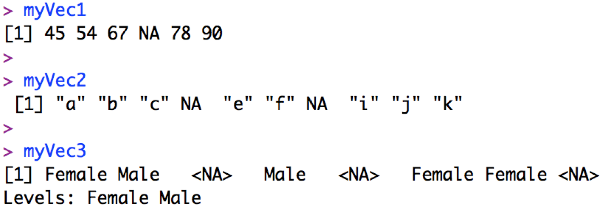

```{r echo= FALSE}

 ChlData<-read.csv("Chlorophyll.csv", header=TRUE)
```


# Why you want to do it: 

Missing values are important and interesting, and they can affect how functions can be used on your data.

Note that R uses `NA` (i.e. 'not available') to indicate missing values of any class (numeric, character, factor):  


  
  
::: {.callout-tip collapse="true"}
R will also use `NaN` (i.e. "Not a Number") for missing numerics, and `NULL` when results of a function are undefined.  We can also tell R what we want to consider a missing number (e.g. in some databases 9999 is used to represent a missing value) with the `na.strings=...` argument when we read in the data.  

:::

# How you can do it: 

## Finding missing values

You can also find missing values in a vector (e.g. column) using the `is.na()` function:
```{r}
is.na(ChlData$Chl)
```

and identify locations of missing values with:
```{r}
which(is.na(ChlData$Chl) == TRUE)
```

You can count how many missing values you have with the `length()` function: 

```{r}
myNA <- which(is.na(ChlData$Chl) == TRUE) # locate the missing values

length(myNA) # count the missing values
```


## Working around missing values

You can apply functions to objects or their components when missing values are present by letting R know what you want R to do with the missing values.  For example, getting the overall mean of the chlorophyll column without telling R how to handle missing values:  

```{r}
mean(ChlData$Chl)
```

vs. telling R to remove them with the `na.rm = ...` argument:  

```{r}
mean(ChlData$Chl, na.rm = TRUE)
```

Note that the data frame itself remains unchanged (the missing values are still there), but R ignores the NAs when calculating the mean.  You can find out more about how a particular function handles missing values by looking at the function's help file (e.g. `?mean`).

## Removing missing values

You can remove rows containing a missing value in a **particular** column with the `subset()` function.  For example, you can remove any row with missing `Month` data with:

```{r}
head(ChlData) # Original data frame

subset(ChlData, is.na(Month) == FALSE) 

```

Note that you use `is.na(Month) == FALSE` here as you want to keep all rows where `Month` is *not* NA.  

Also, note that there are rows with NA remaining in the `Chl` column.

Finally, you can remove all rows that are incomplete (i.e. containing **any** missing values) with the `na.omit()` function:  

```{r}
head(ChlData) # Original data frame
 
ChlData <- na.omit(ChlData) # Remove the NAs

head(ChlData) # Data frame without NAs
```

Note that the above code reassigns the output of the `na.omit()` function back to the name `ChlData`.  This replaces the original data frame with the new data frame without missing values.  Instead, you could save it as a new object (with a new name) so the original is not overwritten.
  
  
::: {.callout-tip collapse="true"}

Take a look at the numbers that print out to the left of the data frame:

```{r}
head(ChlData)
```

These are row names that were assigned when the data were read in.  You can ignore row names but I wanted to to explain them as they can be distracting when one starts manipulating data frames.  Unless you specify otherwise, rows are named by their original position when the data are read in to R, e.g. initially row #3 was assigned the name "3", and row #4 was assigned the name "4", etc. Since you have removed some rows with `na.omit()` above, the row names now skip from e.g. 2 to 4 (row 3 has been removed), but note that the 3rd row in the data frame can still be accessed with:  

```{r}
ChlData[3,]
```

You can choose your own row names with the `rownames()` function (or column names with the `colnames()` function) as well as with arguments in e.g. `read.csv()`.  

:::


::: footnotes
:::