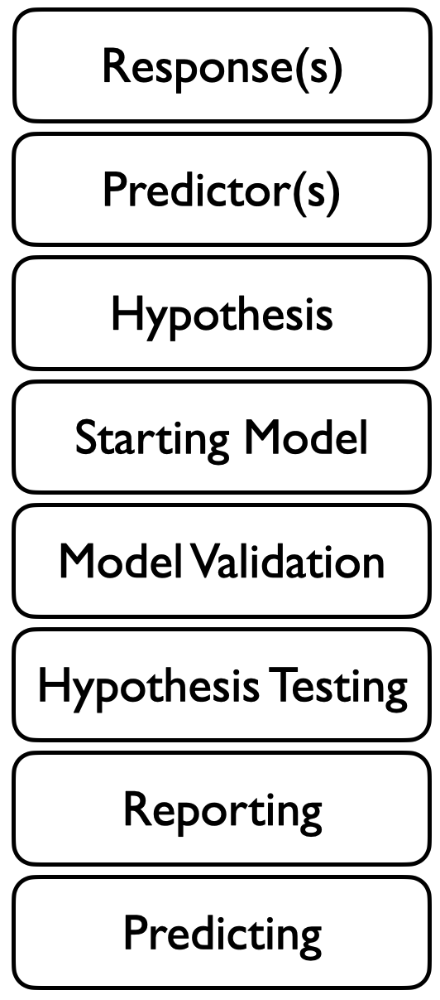
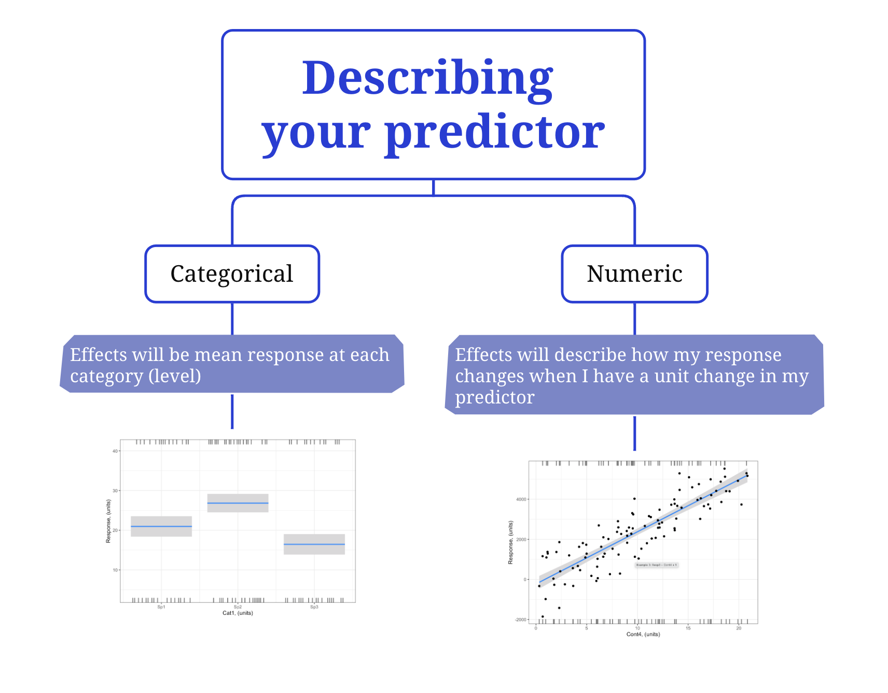

::: {.callout-note collapse="false"} 
## In this section you will:

* Identify variables that might mechanistically be causing variability in your response (what could explain the variability in your response?).

* Consider how to measure these predictor variables.

:::

# The search for mechanistic explanations
Often very quickly, you will start to have ideas about what mechanistically might be responsible for the variation in your response, i.e. what is causing the variability in your response. This is exciting! This is where you can apply biological theory to form your research hypothesis explaining the variability you see in the world. This step needs you to be curious, creative, and tap into your foundation of biological theory. And this step is where you identify the predictors in your statistical model.

Here your focus is on the biological mechanisms (or processes) that you expect affect your response variable. An example of a mechanism affecting plant height might be temperature-dependent growth as temperature controls the rate of enzymatic reactions involved in plant growth.

So your response variable is the variability you are trying to explain, and your predictor(s) is what you think is causing the variability. We will use the term "predictors" but note that they are also known as "covariates", "factors", "independent variables", "explanatory variables", or "x variables".

# Measuring your predictors

Once you have identified a possible mechanism, you can identify a measurable factor that can be used to quantify that mechanism. This is a predictor. To follow our example, a corresponding predictor to measure an effect of temperature-dependent growth is ambient temperature.

It is necessary also to spend some time thinking about *how* you will measure your predictor.  Here, you will want to measure the mechanism as directly as possible. Think about how measures of your predictor can be made as relevant as possible to your response variable.  Put another way: how would the mechanism appear in the observation?

To complete our example, you will want to measure ambient temperature quite close to each plant, and need to consider not just the temperature on the day the plant height was measured, but throughout the growing period of the plant (e.g. by considering average or integrated temperature measures).

It is also useful to consider the nature of your predictors.  This will help you start to picture your research hypothesis and build your statistical model to test this hypothesis ([more on this here][DSPPH_SM_StartingModel.qmd]).  In particular, you want to consider if you will measure your predictor as categorical (e.g. treatment vs. control) or numeric (e.g. amount of fertilizer).  

# "Blue-sky" thinking
It is important that you let yourself think freely when you are considering what might by causing the variability in your response variable. At this early stage, do not restrict yourself to what you will be able to measure and test - let your curiosity and ideas range freely (called "blue-sky thinking"). Think first about all the mechanisms that may be responsible for the response variability. Then think about all the ways observations may be limited (e.g. limitations in our ability to measure certain variables or access data from certain places or times). And take lots of notes! As you move on in the framework, you will quickly simplify your hypothesis into what is measured and what is testable, but all your exciting ideas will be used  to communicate the scope of your study, motivate your predictor choice^[for example, when you communicate your work in your Introduction and Methods], to put your results into context of greater biological theory, as well as direct future study efforts to focus on variation in your response that remains unexplained^[in your Discussion section]. Spending some time allowing yourself to brainstorm at this point is time well spent.

::: footnotes
:::

