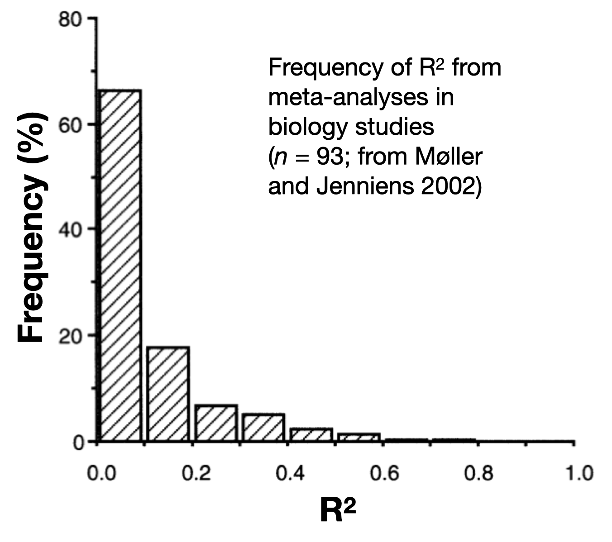

```{r} 
#| echo: false
knitr::opts_chunk$set(warning = FALSE, message = FALSE) 
```


```{r echo = FALSE}
# EXAMPLE 1 ----
rm(list=ls())
library(dplyr)

# Example 1: Resp1 ~ Cat1
 n=100
 ss<-sample(c(1:1000), 1)
 set.seed(679) #582
Cat1<-as.factor(sample(c("G", "K", "R"), size=n, replace=TRUE))

library(dplyr)
Group <- as.factor(sample(c("Site1", "Site2", "Site3", "Site4", "Site5", "Site6"),
                           n, replace=TRUE))
uResp<-(as.numeric(Cat1)*4.4+3.9*as.numeric(Group))#+sample(c(200:900), n, replace = TRUE)
Resp<-rnorm(n, uResp, 4.5)
Group <- recode(Group,
                    Site1 = 'Site3',
                    Site2 = 'Site1',
                    Site3 = 'Site5',
                   Site4 = 'Site4',
                   Site5 = 'Site2',
                   Site6 = 'Site6')
Group <- factor(Group, levels = c("Site1","Site2","Site3","Site4","Site5","Site6"))
Cat1 <- recode(Cat1,
                    K = 'Sp1',
                    R = 'Sp2',
                    G = 'Sp3')
Cat1<-factor(Cat1, levels = c("Sp1", "Sp2", "Sp3"))
myDat1<-data.frame(Cat1=Cat1, Resp1=round(Resp,1))
# #write.csv(myDat, "DatEx1.csv", row.names = FALSE)
# 
# library(ggplot2)
# ggplot()+
#   geom_point(data=myDat,
#              mapping=aes(x=Cat1, y=Resp1))
#
startMod<-glm(formula = Resp1 ~ Cat1 + 1, # hypothesis
              data = myDat1, # data
              family = gaussian(link="identity")) # error distribution assumption
# 
# 
# 
library(DHARMa)
# simulationOutput <- simulateResiduals(fittedModel = startMod, n = 250) # simulate data from our model n times
# #
# plot(simulationOutput, asFactor=TRUE) # compare simulated data to our observations
# #
# plot(simulationOutput,
#      form=myDat1$Cat1,
#      asFactor=TRUE) # compare simulated data to our observations
# # #
# myDat$Resid<-simulationOutput$scaledResiduals
# # # # 
# 
# # #
# ggplot()+
#   geom_violin(data=myDat,
#              mapping = aes(x=Group, y=Resid))
# 
# #
# #
library(MuMIn)
options(na.action = "na.fail") # needed for dredge() function to prevent illegal model comparisons
dredgeOut<-dredge(startMod) # fit and compare a model set representing all possible predictor combinations
#
bestMod<-(eval(attr(dredgeOut, "model.calls")$`2`)) # extract model #8 from dredge table
#
# #
# library(emmeans)
# forComp <- emmeans(bestMod, specs =  ~ Cat1, type = "response")
# forComp
# plot(forComp)
# plot(forComp, comparisons = TRUE)
# plot(pairs(emmeans(bestMod, "Cat1"),
#               adjust="scheffe"))

dredgeOut1<-dredgeOut
bestMod1<-bestMod

# EXAMPLE 2 ----


#rm(list=ls())
n=100
ss<-sample(c(1:1000), 1)
set.seed(114) #114
Cat2<-factor(sample(c("TypeA", "TypeB", "TypeC", "TypeD"), size=n, replace=TRUE))
Cat3<-factor(sample(c("Treat1", "Control"), size=n, replace=TRUE), levels=c("Treat1", "Treat2", "Control"))
uResp<-(as.numeric(Cat2)*40.4-33.3*as.numeric(Cat3)+ 23*as.numeric(Cat3)*as.numeric(Cat2))+sample(c(100:300), n, replace = TRUE)
Resp<-rnorm(n, uResp, 4.5)
Cat3[sample(which(Cat3=="Treat1"), round(length(which(Cat3=="Treat1"))/2), replace=TRUE)]<-"Treat2"
Cat2 <- recode(Cat2,
                    TypeC = 'TypeA',
                    TypeD = 'TypeB',
                    TypeB = 'TypeC',
                   TypeA = 'TypeD')
Cat2 <- factor(Cat2, levels = c("TypeA", "TypeB", "TypeC", "TypeD"))

myDat2<-data.frame(Resp2=Resp, Cat2=Cat2, Cat3=Cat3)
# # #write.csv(myDat2, "DatEx2.csv", row.names = FALSE)
# 
# ggplot()+
#   geom_point(data=myDat2,
#              mapping=aes(x=Cat2, y=Resp2, col=Cat3))
#
startMod<-glm(formula = Resp2 ~ Cat2 + Cat3 + Cat2:Cat3, # hypothesis
              data = myDat2, # data
              family = gaussian(link="identity")) # error distribution assumption


# library(DHARMa)
# simulationOutput <- simulateResiduals(fittedModel = startMod, n = 250) # simulate data from our model n times
# #
# plot(simulationOutput, asFactor=TRUE) # compare simulated data to our observations
# #
# plot(simulationOutput,
#      form=myDat2$Cat2,
#      asFactor=TRUE) # compare simulated data to our observations
# 
# plot(simulationOutput,
#      form=myDat2$Cat3,
#      asFactor=TRUE) # compare simulated data to our observations
# 
# # 
# #
# #
library(MuMIn)
options(na.action = "na.fail") # needed for dredge() function to prevent illegal model comparisons
dredgeOut<-dredge(startMod, extra = "R^2") # fit and compare a model set representing all possible predictor combinations
# dredgeOut
#
bestMod<-(eval(attr(dredgeOut, "model.calls")$`8`)) # extract model #8 from dredge table
#
# #
# library(emmeans)
# forComp <- emmeans(bestMod, specs =  ~ Cat1, type = "response")
# forComp
# plot(forComp)
# plot(forComp, comparisons = TRUE)
# plot(pairs(emmeans(bestMod, "Cat1"),
#               adjust="scheffe"))

dredgeOut2<-dredgeOut
bestMod2<-bestMod

# EXAMPLE 3 ----


#rm(list=ls())
n=100
ss<-sample(c(1:1000), 1)
set.seed(261) #261
Num4<-round(runif(n, 0.3, 20.9),2)
uResp<-245*Num4+ 10
Resp<-rnorm(n, uResp, 850)
myDat3<-data.frame(Resp3=Resp, Num4=Num4)

# # #write.csv(myDat3, "DatEx3.csv", row.names = FALSE)


# ggplot()+
#   geom_point(data=myDat3,
#              mapping=aes(x=Num4, y=Resp3))

startMod<-glm(formula = Resp3 ~ Num4 + 1, # hypothesis
              data = myDat3, # data
              family = gaussian(link="identity")) # error distribution assumption


# # 
# library(DHARMa)
# simulationOutput <- simulateResiduals(fittedModel = startMod, n = 250) # simulate data from our model n times
# #
# plot(simulationOutput, asFactor=TRUE) # compare simulated data to our observations
# #
# plot(simulationOutput,
#      form=myDat3$Num4,
#      asFactor=FALSE) # compare simulated data to our observations
# 
# #
# #
# #
library(MuMIn)
options(na.action = "na.fail") # needed for dredge() function to prevent illegal model comparisons
dredgeOut<-dredge(startMod) # fit and compare a model set representing all possible predictor combinations
#dredgeOut
#
bestMod<-(eval(attr(dredgeOut, "model.calls")$`2`)) # extract model #8 from dredge table
#
# #
# library(emmeans)
# forComp <- emmeans(bestMod, specs =  ~ Cat1, type = "response")
# forComp
# plot(forComp)
# plot(forComp, comparisons = TRUE)
# plot(pairs(emmeans(bestMod, "Cat1"),
#               adjust="scheffe"))

dredgeOut3<-dredgeOut
bestMod3<-bestMod

# EXAMPLE 4 ----


#rm(list=ls())
n=100
ss<-sample(c(1:1000), 1)
set.seed(444) #444
Cat5<-as.factor(sample(c("Wild", "Farm", "Urban"), size=n, replace=TRUE))
Num6<-round(runif(n, 300, 700),2)
uResp<-(as.numeric(Cat5)*0.014-0.02*Num6+ as.numeric(Cat5)*0.014*Num6)+100
Resp<-rnorm(n, uResp, 2.5)
myDat4<-data.frame(Resp4=Resp, Cat5=Cat5, Num6=Num6)

# # #write.csv(myDat3, "DatEx3.csv", row.names = FALSE)


# ggplot()+
#   geom_point(data=myDat3,
#              mapping=aes(x=Cont5, y=Resp3, col=Cat4))

startMod<-glm(formula = Resp4 ~ Cat5 + Num6 + Cat5:Num6 + 1, # hypothesis
              data = myDat4, # data
              family = gaussian(link="identity")) # error distribution assumption


# 
# library(DHARMa)
# simulationOutput <- simulateResiduals(fittedModel = startMod, n = 250) # simulate data from our model n times
# #
# plot(simulationOutput, asFactor=TRUE) # compare simulated data to our observations
# #
# plot(simulationOutput,
#      form=myDat3$Cat4,
#      asFactor=TRUE) # compare simulated data to our observations
# 
# plot(simulationOutput,
#      form=myDat3$Cont5,
#      asFactor=FALSE) # compare simulated data to our observations

#
#
# #
library(MuMIn)
options(na.action = "na.fail") # needed for dredge() function to prevent illegal model comparisons
dredgeOut<-dredge(startMod, extra = "R^2") # fit and compare a model set representing all possible predictor combinations
#dredgeOut
#
bestMod<-(eval(attr(dredgeOut, "model.calls")$`8`)) # extract model #8 from dredge table
#
# #
# library(emmeans)
# forComp <- emmeans(bestMod, specs =  ~ Cat1, type = "response")
# forComp
# plot(forComp)
# plot(forComp, comparisons = TRUE)
# plot(pairs(emmeans(bestMod, "Cat1"),
#               adjust="scheffe"))

dredgeOut4<-dredgeOut
bestMod4<-bestMod

```


# Reporting how well your model explains your response {#sec_reportExplainedDeviance}

::: {.alert .alert-success}
This section is similar regardless of your model structure (e.g. error distribution assumption).  The examples below all assume a normal error distribution assumption but you can use the process presented here for models of any structure.
:::

In this section you will report

* how much variation (deviance) in your response is explained by your model

* how important each of your predictors is in explaining that deviance

## how much variation (deviance) in your response is explained by your model

If you will recall, your whole motivation for pursuing statistical modelling was to explain variation in your response.  Thus, it is important that you quantify how much variation in your response you are able to explain by your model.

Note that **we will discuss this as "explained deviance" rather than "explained variation"**.  This is because the term "variance" is associated with models where the error distribution assumption is normal, whereas deviance is a more universal term.  

When you have a **normal error distribution assumption and linear shape assumption**, you can capture the amount of explained deviance simply by comparing the variation in your response (i.e. the starting variation *before* you fit your model - the null variation) vs. the variation in your model residuals (i.e. the remaining variation *after* you fit your model - the residual variation) as the $R^2$:

$R^2 = 1 - \frac{residual variation}{null variation}$

From this equation, you can see how, if your model is able to explain all the variation in the response, the residual variation will be zero, and $R^2 = 1$.  Alternatively, if the model explains no variation in the response the residual variation equals the null variation and $R^2 = 0$.

For models with **other error distribution and shape assumptions**, you need another way of estimating the goodness of fit of your model.  You can do this through estimating a pseudo $R^2$. 

There are many many different types of pseudo $R^2$.^[check the [rr2 package](https://cran.r-project.org/web/packages/effectsize/vignettes/interpret.html) for many different options] One useful pseudo $R^2$ is called the Likelihood Ratio $R^2$ or $R^2_{LR}$.  The $R^2_{LR}$ compares the likelihood of your best-specified model to the likelihood of the null model:

$R^2_{LR} = 1-exp(-\frac{2}{n}(log𝓛(model)-log𝓛(null)))$

where $n$ is the number of observations, $log𝓛(model)$ is the log-likelihood of your model, and $log𝓛(null)$ is the log-likelihood of the null model.  The $R^2_{LR}$ is the type of pseudo $R^2$ that shows up in your `dredge()` output when you add `extra = "R^2"` to the `dredge()` call.  You can calculate $R^2_{LR}$ by hand, read it from our `dredge()` output, or estimate it using `r.squaredLR()` from the MuMIn package:

```{r}
r.squaredLR(bestMod1)
```

Note here that two values of $R^2_{LR}$ are reported. The adjusted pseudo $R^2$ given here under `attr(,"adj.r.squared")` has been scaled so that $R^2_{LR}$ can reach a maximum of 1, similar to a regular $R^2$^[this is called the Nagelkerke's modified statistic - see `?r.squaredLR` for more information].

Let's compare this to the traditional $R^2$: 

```{r}
1-summary(bestMod1)$deviance/summary(bestMod1)$null.deviance
```

Note that the two estimates are similar: One nice feature of the $R^2_{LR}$ is that it is equivalent to the regular $R^2$ when our model assumes a normal error distribution assumption and linear shape assumption, so you can use $R^2_{LR}$ for a wide range of models.


:::{.callout-note collapse="true" title="Aside: what is a *good* $R^2$?"} 



Recall that your goal in hypothesis testing is to explain the variation in your response - preferably as much variation as possible!  So it is natural to hope for a high `R^2` but this is a trap: the results of your hypothesis testing^[when done in a robust fashion] are valuable whether you are able to explain 3% or 93% of the variation in your response.  Remember:

- You are progressing science either way - helping the field learn about mechanisms and design future experiments.

- Remaining unexplained variation points to potential limitations in measuring predictor effects and/or other predictors (not in your model) that may play a role.

For context, here is a plot of `R^2` values from a meta-analysis of biology studies:

<br clear="right"/>


:::


## how important is each of your predictors in explaining that variation

When you have more than one predictor in your model, you may also want to report how relatively important each predictor is to explaining deviance in your response.  This is also called "partitioning the explained deviance" to the predictors or "variance decomposition".

:::{.callout-caution collapse="true" title="Aside: what we won't be doing"} 

To get an estimate of how much deviance in your response one particular predictor explains, you may be tempted to compute the explained deviance ($R^2$) estimates of models fit to data with and without that particular predictor.  Let us try with our Example 4:

```{r}

dredgeOut4

```

If you want to get an estimate as to how much response deviance the `Num6` predictor explains, you might compare the $R^2$ of a model with and without the `Num6` predictor.

Let's compare model #4 (that includes `Num6`) and model #2 (that does NOT include `Num6`):

```{r}
R2.mod4 <- (dredgeOut4$`R^2`[2]) # model #4 is the second row in dredgeOut4
R2.mod2 <- (dredgeOut4$`R^2`[3]) # model #2 is the third row in dredgeOut4

diffR2 <- R2.mod4 - R2.mod2 # find estimated contribution of Cont to explained deviance

diffR2
```

So it looks like `r round(diffR2,3)*100`% of the variability in `Resp4` is explained by `Num6`.

But what if instead you chose to compare model #3 (that includes `Num6`) and model #1 (that does NOT include `Num6`):

```{r}
R2.mod3 <- (dredgeOut4$`R^2`[4]) # model #3 is the fourth row in dredgeOut4
R2.mod1 <- (dredgeOut4$`R^2`[5]) # model #1 is the fifth row in dredgeOut4

diffR2 <- R2.mod3 - R2.mod1 # find estimated contribution of Cont to explained deviance

diffR2
```

Now it looks like `r round(diffR2,3)*100`% of the variability in `Resp4` is explained by `Num6`! Quite a different answer!  Your estimates of the contribution of `Num6` to explaining the response deviation do not agree because of collinearity among your predictors - more on this in the section on [Model Validation](DSPPH_SM_ModelValidation.qmd).

:::

There are a few options you can use to get a robust estimate of how much each predictor is contributing to explained deviance in your response.

One option for partitioning the explained deviance when you have collinearity among your predictors is hierarchical partitioning.  Hierarchical partitioning estimates the average independent contribution of each predictor to the total explained variance by considering all models in the candidate model set^[i.e. in the `dredge()` output].  This method is beyond the scope of the course but see the [rdacca.hp package](https://cran.r-project.org/web/packages/rdacca.hp/index.html) for an example of how to do this.  

Another method (**that we will be using**) for estimating the importance of each term (predictor or interaction) in your model is by looking at the candidate model set ranking made by `dredge()`.  Here you can measure the importance of a predictor by summing up the Akaike weights for any model that includes a particular predictor.  The Akaike weight of a model compares the likelihood of the model scaled to the total likelihood of all the models in the candidate model set.  The sum of Akaike weights for models including a particular predictor tells you how important the predictor is in explaining the deviance in your response.  You can calculate the sum of Akaike weights directly with the `sw()` function in the MuMIn package:

```{r}

sw(dredgeOut4)

```

Here we can see that all model terms (the predictors `Cat5` and `Num6` as well as the interaction) are equally important in explaining the deviance in `Resp4` (they appear in all models that have any Akaike weight).  

Let's look at these two steps 

* how much deviance in your response is explained by your model

* how important each of your predictors is in explaining that deviance

with our examples:

:::{.callout-tip collapse="true" title="Example 1: Resp1 ~ Cat1 + 1"} 

#### Example 1: Resp1 ~ Cat1 + 1

* how much deviance in your response is explained by your model

```{r}
R2 <- r.squaredLR(bestMod1)

R2

```

The best-specified model explains `r round(data.frame(R2),3)*100`% of the deviance in `Resp1`.

* how important each of your predictors is in explaining that deviance


```{r}

dredgeOut2

```

```{r}

sw(dredgeOut1)

```


With Example 1, you have only one predictor (`Cat1`) and so this predictor is responsible for explaining all of the variability in your response (`Resp1`).  You can see that it appears in all models with any weight with your `sw()` function from the MuMIn package.


:::


:::{.callout-tip collapse="true" title="Example 2: Resp2 ~ Cat2 + Cat3 + Cat2:Cat3 + 1"} 

#### Example 2: Resp2 ~ Cat2 + Cat3 + Cat2:Cat3 + 1

* how much deviance in your response is explained by your model

```{r}
R2 <- r.squaredLR(bestMod2)

R2

```

The best-specified model explains `r round(data.frame(R2),3)*100`% of the deviance in `Resp2`.

* how important each of your predictors is in explaining that deviance

```{r}

dredgeOut2

```


```{r}

sw(dredgeOut2)

```

Here you can see that `Cat2` and `Cat3` are equally important in explaining the deviance in `Resp2` (they appear in all models that have any Akaike weight), while the interaction term between `Cat2` and `Cat3` is less important (only appearing in one model with Akaike weight, though this is the top model).  


:::

:::{.callout-tip collapse="true" title="Example 3: Resp3 ~ Num4 + 1"} 

#### Example 3: Resp3 ~ Num4 + 1

* how much deviance in your response is explained by your model

```{r}
R2 <- r.squaredLR(bestMod3)

R2

```

The best-specified model explains `r round(data.frame(R2),3)*100`% of the deviance in `Resp3`.

* how important each of your predictors is in explaining that deviance

```{r}

dredgeOut3

```


```{r}

sw(dredgeOut3)

```

With Example 3, you have only one predictor (`Num6`) and so this predictor is responsible for explaining all of the variability in your response (`Resp3`).  You can see that it appears in all models with any weight with your `sw()` function from the MuMIn package.
 

:::

:::{.callout-tip collapse="true" title="Example 4: Resp4 ~ Cat5 + Num6 + Cat5:Num6 + 1"} 

#### Example 4: Resp4 ~ Cat5 + Num6 + Cat5:Num6 + 1


* how much deviance in your response is explained by your model

```{r}
R2 <- r.squaredLR(bestMod4)

R2

```

The best-specified model explains `r round(data.frame(R2),3)*100`% of the deviance in `Resp2`.

* how important each of your predictors is in explaining that deviance

```{r}

dredgeOut4

```


```{r}

sw(dredgeOut4)

```

Here you can see that `Cat5`, `Num6` and the interaction `Cat5:Num6` are all equally important in explaining the deviance in `Resp4` (they appear in all models that have any Akaike weight).


:::

# [Back to Reporting main page](DSPPH_SM_Reporting.qmd)