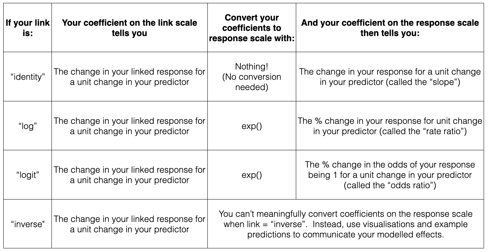
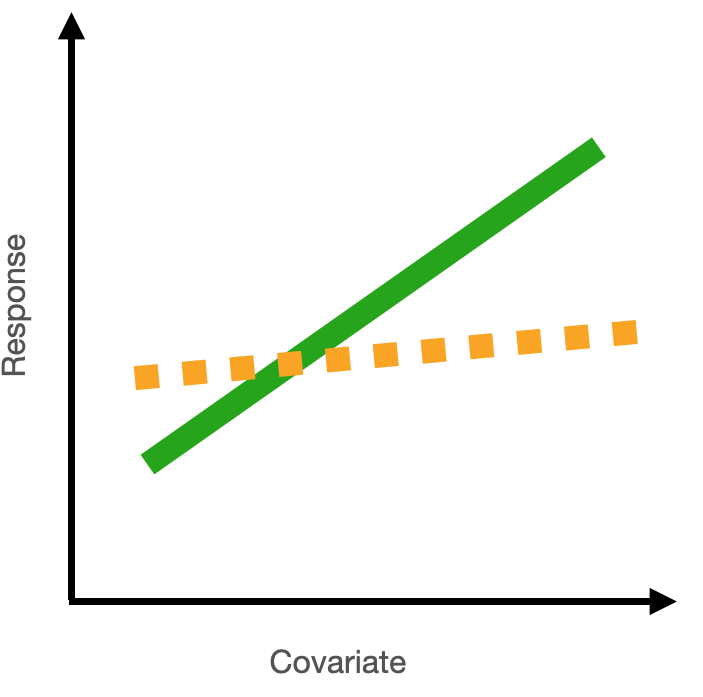
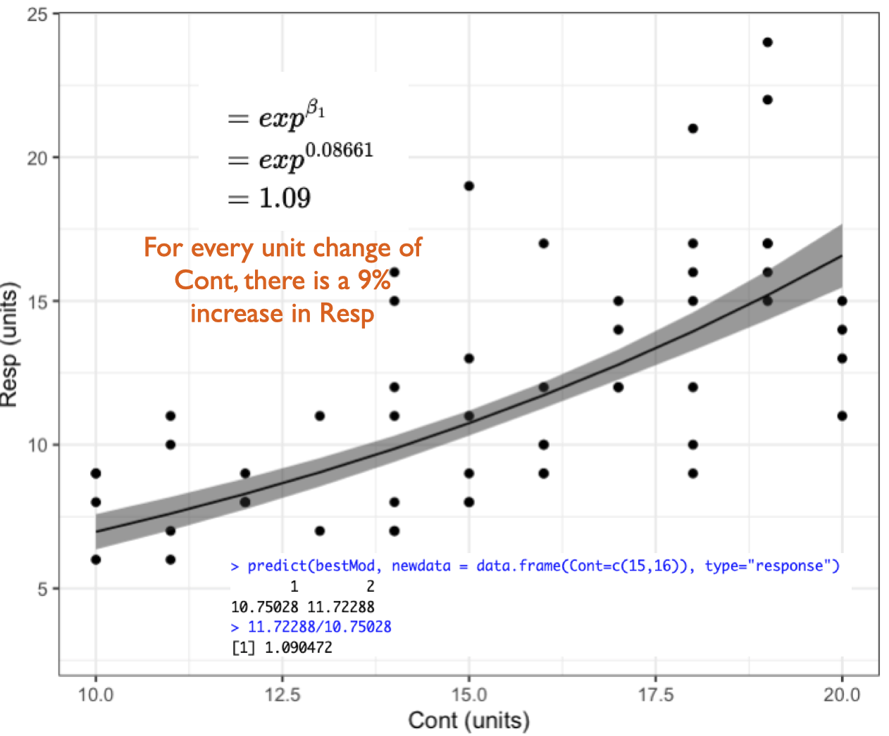

```{r} 
#| echo: false
knitr::opts_chunk$set(warning = FALSE, message = FALSE) 

library(ggplot2)

library(visreg)
```


```{r echo = FALSE}
# EXAMPLE 1 ----
rm(list=ls())
library(dplyr)

# Example 1: Resp1 ~ Cat1
 n=100
 ss<-sample(c(1:1000), 1)
 set.seed(679) #582
Cat1<-as.factor(sample(c("G", "K", "R"), size=n, replace=TRUE))

library(dplyr)
Group <- as.factor(sample(c("Site1", "Site2", "Site3", "Site4", "Site5", "Site6"),
                           n, replace=TRUE))
uResp<-(as.numeric(Cat1)*4.4+3.9*as.numeric(Group))#+sample(c(200:900), n, replace = TRUE)
Resp<-rnorm(n, uResp, 4.5)
Group <- recode(Group,
                    Site1 = 'Site3',
                    Site2 = 'Site1',
                    Site3 = 'Site5',
                   Site4 = 'Site4',
                   Site5 = 'Site2',
                   Site6 = 'Site6')
Group <- factor(Group, levels = c("Site1","Site2","Site3","Site4","Site5","Site6"))
Cat1 <- recode(Cat1,
                    K = 'Sp1',
                    R = 'Sp2',
                    G = 'Sp3')
Cat1<-factor(Cat1, levels = c("Sp1", "Sp2", "Sp3"))
myDat1<-data.frame(Cat1=Cat1, Resp1=round(Resp,1))
# #write.csv(myDat, "DatEx1.csv", row.names = FALSE)
# 
# library(ggplot2)
# ggplot()+
#   geom_point(data=myDat,
#              mapping=aes(x=Cat1, y=Resp1))
#
startMod<-glm(formula = Resp1 ~ Cat1 + 1, # hypothesis
              data = myDat1, # data
              family = gaussian(link="identity")) # error distribution assumption
# 
# 
# 
library(DHARMa)
# simulationOutput <- simulateResiduals(fittedModel = startMod, n = 250) # simulate data from our model n times
# #
# plot(simulationOutput, asFactor=TRUE) # compare simulated data to our observations
# #
# plot(simulationOutput,
#      form=myDat1$Cat1,
#      asFactor=TRUE) # compare simulated data to our observations
# # #
# myDat$Resid<-simulationOutput$scaledResiduals
# # # # 
# 
# # #
# ggplot()+
#   geom_violin(data=myDat,
#              mapping = aes(x=Group, y=Resid))
# 
# #
# #
library(MuMIn)
options(na.action = "na.fail") # needed for dredge() function to prevent illegal model comparisons
dredgeOut<-dredge(startMod) # fit and compare a model set representing all possible predictor combinations
#
bestMod<-(eval(attr(dredgeOut, "model.calls")$`2`)) # extract model #8 from dredge table
#
# #
# library(emmeans)
# forComp <- emmeans(bestMod, specs =  ~ Cat1, type = "response")
# forComp
# plot(forComp)
# plot(forComp, comparisons = TRUE)
# plot(pairs(emmeans(bestMod, "Cat1"),
#               adjust="scheffe"))

dredgeOut1<-dredgeOut
bestMod1<-bestMod

# EXAMPLE 2 ----


#rm(list=ls())
n=100
ss<-sample(c(1:1000), 1)
set.seed(114) #114
Cat2<-factor(sample(c("TypeA", "TypeB", "TypeC", "TypeD"), size=n, replace=TRUE))
Cat3<-factor(sample(c("Treat1", "Control"), size=n, replace=TRUE), levels=c("Treat1", "Treat2", "Control"))
uResp<-(as.numeric(Cat2)*40.4-33.3*as.numeric(Cat3)+ 23*as.numeric(Cat3)*as.numeric(Cat2))+sample(c(100:300), n, replace = TRUE)
Resp<-rnorm(n, uResp, 4.5)
Cat3[sample(which(Cat3=="Treat1"), round(length(which(Cat3=="Treat1"))/2), replace=TRUE)]<-"Treat2"
Cat2 <- recode(Cat2,
                    TypeC = 'TypeA',
                    TypeD = 'TypeB',
                    TypeB = 'TypeC',
                   TypeA = 'TypeD')
Cat2 <- factor(Cat2, levels = c("TypeA", "TypeB", "TypeC", "TypeD"))

myDat2<-data.frame(Resp2=Resp, Cat2=Cat2, Cat3=Cat3)
# # #write.csv(myDat2, "DatEx2.csv", row.names = FALSE)
# 
# ggplot()+
#   geom_point(data=myDat2,
#              mapping=aes(x=Cat2, y=Resp2, col=Cat3))
#
startMod<-glm(formula = Resp2 ~ Cat2 + Cat3 + Cat2:Cat3, # hypothesis
              data = myDat2, # data
              family = gaussian(link="identity")) # error distribution assumption


# library(DHARMa)
# simulationOutput <- simulateResiduals(fittedModel = startMod, n = 250) # simulate data from our model n times
# #
# plot(simulationOutput, asFactor=TRUE) # compare simulated data to our observations
# #
# plot(simulationOutput,
#      form=myDat2$Cat2,
#      asFactor=TRUE) # compare simulated data to our observations
# 
# plot(simulationOutput,
#      form=myDat2$Cat3,
#      asFactor=TRUE) # compare simulated data to our observations
# 
# # 
# #
# #
library(MuMIn)
options(na.action = "na.fail") # needed for dredge() function to prevent illegal model comparisons
dredgeOut<-dredge(startMod, extra = "R^2") # fit and compare a model set representing all possible predictor combinations
# dredgeOut
#
bestMod<-(eval(attr(dredgeOut, "model.calls")$`8`)) # extract model #8 from dredge table
#
# #
# library(emmeans)
# forComp <- emmeans(bestMod, specs =  ~ Cat1, type = "response")
# forComp
# plot(forComp)
# plot(forComp, comparisons = TRUE)
# plot(pairs(emmeans(bestMod, "Cat1"),
#               adjust="scheffe"))

dredgeOut2<-dredgeOut
bestMod2<-bestMod

# EXAMPLE 3 ----


#rm(list=ls())
n=100
ss<-sample(c(1:1000), 1)
set.seed(261) #261
Num4<-round(runif(n, 0.3, 20.9),2)
uResp<-245*Num4+ 10
Resp<-rnorm(n, uResp, 850)
myDat3<-data.frame(Resp3=Resp, Num4=Num4)

# # #write.csv(myDat3, "DatEx3.csv", row.names = FALSE)


# ggplot()+
#   geom_point(data=myDat3,
#              mapping=aes(x=Num4, y=Resp3))

startMod<-glm(formula = Resp3 ~ Num4 + 1, # hypothesis
              data = myDat3, # data
              family = gaussian(link="identity")) # error distribution assumption


# # 
# library(DHARMa)
# simulationOutput <- simulateResiduals(fittedModel = startMod, n = 250) # simulate data from our model n times
# #
# plot(simulationOutput, asFactor=TRUE) # compare simulated data to our observations
# #
# plot(simulationOutput,
#      form=myDat3$Num4,
#      asFactor=FALSE) # compare simulated data to our observations
# 
# #
# #
# #
library(MuMIn)
options(na.action = "na.fail") # needed for dredge() function to prevent illegal model comparisons
dredgeOut<-dredge(startMod) # fit and compare a model set representing all possible predictor combinations
#dredgeOut
#
bestMod<-(eval(attr(dredgeOut, "model.calls")$`2`)) # extract model #8 from dredge table
#
# #
# library(emmeans)
# forComp <- emmeans(bestMod, specs =  ~ Cat1, type = "response")
# forComp
# plot(forComp)
# plot(forComp, comparisons = TRUE)
# plot(pairs(emmeans(bestMod, "Cat1"),
#               adjust="scheffe"))

dredgeOut3<-dredgeOut
bestMod3<-bestMod

# EXAMPLE 4 ----


#rm(list=ls())
n=100
ss<-sample(c(1:1000), 1)
set.seed(444) #444
Cat5<-as.factor(sample(c("Wild", "Farm", "Urban"), size=n, replace=TRUE))
Num6<-round(runif(n, 300, 700),2)
uResp<-(as.numeric(Cat5)*0.014-0.02*Num6+ as.numeric(Cat5)*0.014*Num6)+100
Resp<-rnorm(n, uResp, 2.5)
myDat4<-data.frame(Resp4=Resp, Cat5=Cat5, Num6=Num6)

# # #write.csv(myDat3, "DatEx3.csv", row.names = FALSE)


# ggplot()+
#   geom_point(data=myDat3,
#              mapping=aes(x=Cont5, y=Resp3, col=Cat4))

startMod<-glm(formula = Resp4 ~ Cat5 + Num6 + Cat5:Num6 + 1, # hypothesis
              data = myDat4, # data
              family = gaussian(link="identity")) # error distribution assumption


# 
# library(DHARMa)
# simulationOutput <- simulateResiduals(fittedModel = startMod, n = 250) # simulate data from our model n times
# #
# plot(simulationOutput, asFactor=TRUE) # compare simulated data to our observations
# #
# plot(simulationOutput,
#      form=myDat3$Cat4,
#      asFactor=TRUE) # compare simulated data to our observations
# 
# plot(simulationOutput,
#      form=myDat3$Cont5,
#      asFactor=FALSE) # compare simulated data to our observations

#
#
# #
library(MuMIn)
options(na.action = "na.fail") # needed for dredge() function to prevent illegal model comparisons
dredgeOut<-dredge(startMod, extra = "R^2") # fit and compare a model set representing all possible predictor combinations
#dredgeOut
#
bestMod<-(eval(attr(dredgeOut, "model.calls")$`8`)) # extract model #8 from dredge table
#
# #
# library(emmeans)
# forComp <- emmeans(bestMod, specs =  ~ Cat1, type = "response")
# forComp
# plot(forComp)
# plot(forComp, comparisons = TRUE)
# plot(pairs(emmeans(bestMod, "Cat1"),
#               adjust="scheffe"))

dredgeOut4<-dredgeOut
bestMod4<-bestMod

```


::: {.alert .alert-danger}
How you quantify your model effects varies with your model structure (e.g. error distribution assumption).

If it is your first time reading this, read through the examples that present models assuming a normal error distribution assumption.  This will help you understand why we are reporting modelled effects in this way.  Then, (if relevant) look at the section on the error distribution assumption you are interested in for your model. 
:::

In this section, you will learn how to report your modelled effects directly - the change in your response given a unit change in your predictor.  These effects are quantified in the estimates of your coefficients (i.e. the magnitude, direction and uncertainty of your coefficient estimates).

How you report your modelled effects will depend on:

* whether you are reporting effects for a categorical or numeric predictor, and 

* your error distribution assumption


We will consider each of these now:

# Reporting your effects for categorical vs. numeric predictors

## Effects of categorical predictors on your response

Effects are the change in your response due to a unit change in your predictor. 

For categorical predictors, the effect is the change in the response when you change the level (category) of your categorical predictor.

You capture the effect of your categorical predictor on your response by reporting the modelled value of the response at each level (category) of your predictor.^[For categorical predictors, this is the same as the process in the section on [giving examples of your modelled effects](DSPPH_SM_RepModEffects_Predict.qmd)]  

You also report the uncertainty around this modelled estimate.  Two common uncertainty estimates are  

i) standard errors (SE) which are a measure of uncertainty of the average modelled effect, and 

ii) the 95% confidence intervals around your modelled effects, which tell you the range your modelled effects would be expected to fall into (with a 95% probability) if you redid your experiment. 

We will focus on the 95% confidence intervals as they tend to be easier to interpret for many different types of models.

When you have a categorical predictor with more than two categories (levels), you will also want to test to see where the effects on the response differ among the categories.  This is done using **multiple comparison testing**, i.e. you will compare the modelled effect on your response of each level of your categorical predictor vs. every other level of your categorical predictor to determine which effects are different from each other (called pairwise testing).  

This is done by testing the null hypothesis that the modelled effects of each pair of category levels are similar to one another, typically rejecting the null hypothesis when P < 0.05. Remember that the P-value is the probability that you observe a value at least as big as the one you observed even though your null hypothesis is true.  In this case, you are looking at the value you are observing as the difference between coefficients estimated for the two levels of your predictor.  The P-value is the probability of getting a difference at least as big as the one you observed even though there is actually no difference between the effects (i.e. the null hypothesis is true).

A few of things to note about multiple comparison testing:

1) Multiple comparison testing is only needed for categorical predictors.

2) Multiple comparison testing is only needed for categorical predictors with more than two levels (or categories).

3) Multiple comparison testing should only be done after your hypothesis testing has given you evidence that the predictor has an effect on your response.  That is, you should only do a multiple comparison test on a predictor if that predictor is in your best-specified model.  As this is a test done after your hypothesis testing, it is called a post-hoc^["post hoc" is a Latin phrase meaning "after the event"] test.  

4) Multiple comparison testing can be a problem because you are essentially repeating a hypothesis test many times on the same data (i.e. are the effects of `Sp1` different than those of `Sp2`?  are the effects of `Sp1` different than those of `Sp3`? are the effects of `Sp2` different than those of `Sp3`?...).  These repeated tests mean there is a high chance that you will find a difference in one test **purely due to random chance**, vs. due to there being an actual difference.  The multiple comparison tests you will perform have been formulated to correct for this increased error.

In summary: reporting effects of categorical predictors on your response means reporting:

* the modelled value of the response at each predictor level,

* the uncertainty of this modelled value (95% confidence interval), and

* the evidence that the effects among levels are different from one another.


## Effects of numeric predictors on your response

Effects are the change in your response due to a unit change in your predictor. 

For numeric predictors, the effect is the change in the response when you increase your numeric predictor by one unit.  

You capture the effect of your numeric predictor on your response by reporting this rate of change as a slope. When the slope (coefficient) is positive, you have an increase in your response with a unit increase in your predictor.  When the slope (coefficient) is negative, you have a decrease in your response with a unit increase in your predictor. When the slope (coefficient) is zero, you have no change in your response for a unit increase in your predictor, and you would conclude that there is no evidence that your predictor explains variability in your response. 

## Effects of interactions between numeric and categorical predictors

Your best-specified model might also include an interaction term.  For example, you might have an interaction between categorical and numeric predictors.  To report the effect of an interaction, you report the effect of the numeric predictor **for each level in your categorical predictor**.  See Example 4 below for how to do this.


# Report your effects after considering your error distribution assumption

When you use a GLM to test your hypothesis, the coefficients are estimated in the "linked world".  You need to convert these back to the response (real) world in order to communicate your effects. 

This is because of the difference between the "link" scale and "response" scale for generalized linear models.

The link scale is where the model fitting happens, and where the evidence for your modelled effects is gathered.

The response scale is back in the real world - these are the actual effects in your response you would expect to see with a change in your predictor.

How you do the conversion to interpret your coefficients depends on your specific error distribution assumption as you need to consider the link function in your model.




### For models with a normal error distribution assumption

For a normal error distribution assumption, the effect of a numeric predictor on the response is the **absolute change in the response** for a unit change in the predictor.

If you have a normal error distribution assumption (and are using `link = "identity"`), your coefficient on the response scale is identical to your coefficient on the link scale.

:::{.callout-note collapse="true" title="the math"} 

Here's a model equation for a generalized linear model:

$$
\begin{align}
g(\mu_i|Pred_i) &= \beta_1 \cdot Pred_i + \beta_0 \\
Resp_i &\sim F(\mu_i) 
\end{align}
$$

where 
* $g()$ is the link function

* $\mu_i$ is the mean fitted value $\mu_i$ dependent on $Pred_i$

* $\beta_1$ is the coefficient of $Pred_i$

* $Pred_i$ is the value of your predictor

* $\beta_0$ is the intercept

* $Resp_i$ is the value of the response variable

* $F$ represents some error distribution assumption


As above, the effect of a numeric predictor on your response is the change in your fitted value ($g(\mu_i)$) for a unit change in your predictor ($Pred_i$):

$$
\begin{align}
g(\mu|Pred+1) - g(\mu|Pred) &= (\beta_1 \cdot (Pred+1) + \beta_0) - (\beta_1 \cdot Pred_i + \beta_0) \\
&=\beta_1 \cdot Pred  + \beta_1 + \beta_0 - \beta_1 \cdot Pred_i - \beta_0 \\
&=\beta_1
\end{align}
$$
For linear models with a normal error distribution assumption (i.e. when you are using `link = "identity"`), the link function $g()$ is not there.  For this reason, you can read the effects of your model directly from the model coefficients ($\beta_1$, $\beta_0$) when you have a normal error distribution assumption.  And for this reason, you will need to convert your model coefficients to quantify your modelled effects when you have an error distribution assumption that is not normal/uses a link function that is not "identity" (see next section).

:::


#### Examples with a normal error distribution assumption: 


:::{.callout-tip collapse="true" title="Example 1: Resp1 ~ Cat1 + 1"} 

###### Example 1: Resp1 ~ Cat1 + 1


Recall that Example 1 contains only one predictor and it is categorical:

`Resp1 ~ Cat1 + 1`


**What are your modelled effects (with uncertainty)?**

In the chapter on your [Starting Model](DSPPH_SM_StartingModel.qmd), you found your coefficients in the "Estimate" column of the `summary()` output of your model: 

```{r echo = FALSE}

forText <- coef(summary(bestMod1)) # extract the coefficients from summary()

```


```{r}

coef(summary(bestMod1)) # extract the coefficients from summary()

```

Interpreting the coefficients from this output takes practice - especially for categorical predictors because of the way that R treats categorical predictors in regression.  With R's "dummy coding", one level of the predictor (here `Sp1`) is incorporated into the intercept estimate (`r round(forText["(Intercept)","Estimate"],1)`) as the reference level.  The other coefficients in the Estimate column represent the change in modelled response when you move from the reference level (`Sp1`) to another level.  

The modelled response when Cat1 = Sp2 is `r round(forText["Cat1Sp2","Estimate"],1)` units higher than this reference level, or  `r round(forText["(Intercept)","Estimate"],1)` + `r round(forText["Cat1Sp2","Estimate"],1)` = `r round(forText["(Intercept)","Estimate"],1) + round(forText["Cat1Sp2","Estimate"],1)` units.  

The modelled `Resp1` when Cat1 = Sp3 is `r round(forText["Cat1Sp3","Estimate"],1)` units **lower** than the reference level, or  `r round(forText["(Intercept)","Estimate"],1)`  `r round(forText["Cat1Sp3","Estimate"],1)` = `r round(forText["(Intercept)","Estimate"],1) + round(forText["Cat1Sp3","Estimate"],1)` units.^[note that the p-values reported in the coefficient table are the result of a test of whether the coefficient associated with `Sp2` is different than that of `Sp1` (p = `r round(forText["Cat1Sp2","Pr(>|t|)"],3)`), and if the effect of `Sp3` is different than that of `Sp1` (p = `r round(forText["Cat1Sp3","Pr(>|t|)"],3)`)), but a comparison of effects of `Sp2` vs. `Sp3` is missing.  We will discuss this more further along in these notes.] 

So all the information we need is in this `summary()` output, but not easy to see immediately. An easier way is to use the emmeans^[emmeans stands for "estimated marginal means"] package which helps you by reporting the coefficients directly^[another option is the [marginaleffects package](https://marginaleffects.com/), where marginal effects represent the average effect - the average difference in your predicted response across a change in your categorical predictor level or a unit change in your numeric predictor[@ArelBundockEtAl2024]].  In our case, you use the emmeans package to get the mean value of the response at each level of the predictor.  For categorical predictors, you do this with the `emmeans()` function: 


```{r}

library(emmeans) # load the emmeans package

emmOut <- emmeans(object = bestMod1, # your model
            specs = ~ Cat1, # your predictors
            type = "response") # report coefficients on the response scale

emmOut

```

So now you have a modelled value of your response for each level of your categorical predictor - this captures the effect of your categorical predictor on your response.  You also need to report uncertainty around this effect, and you can do this by reporting the 95% confidence level (CL) also reported by the `emmeans()` function. 

When Cat1 is Sp1, Resp1 is estimated to be `r round(summary(emmeans(object = bestMod1, specs = ~ Cat1, type = "response"))$emmean[1], 1)` units (95% confidence level: `r round(summary(emmeans(object = bestMod1, specs = ~ Cat1, type = "response"))$lower.CL[1],1)` to `r round(summary(emmeans(object = bestMod1, specs = ~ Cat1, type = "response"))$upper.CL[1],1)` units).  
When Cat1 is Sp2, Resp1 is estimated to be `r round(summary(emmeans(object = bestMod1, specs = ~ Cat1, type = "response"))$emmean[2], 1)` units (95% confidence level: `r round(summary(emmeans(object = bestMod1, specs = ~ Cat1, type = "response"))$lower.CL[2],1)` to `r round(summary(emmeans(object = bestMod1, specs = ~ Cat1, type = "response"))$upper.CL[2],1)` units).  
When Cat1 is Sp3, Resp1 is estimated to be `r round(summary(emmeans(object = bestMod1, specs = ~ Cat1, type = "response"))$emmean[3], 1)` units (95% confidence level: `r round(summary(emmeans(object = bestMod1, specs = ~ Cat1, type = "response"))$lower.CL[3],1)` to `r round(summary(emmeans(object = bestMod1, specs = ~ Cat1, type = "response"))$upper.CL[3],1)` units.  

Note that this is the same information in the `summary()` output just easier to read.^[note that the `summary()` output becomes easier to read if you force the starting model not to have an intercept with: `startMod<-glm(formula = Resp1 ~ Cat1 - 1, data = myDat, family = gaussian(link="identity"))`. This is fine to do here where you **only** have categorical predictors but causes problems when you start having numeric predictors in your model as well.  So we won't be practicing this in class and instead will use the very flexible and helpful emmeans package to help us report coefficients from our statistical models.]

Note also that two types of uncertainty are measured here.  `SE` stands for the standard error around the prediction, and is a measure of uncertainty of the average modelled effect.  The `lower.CL` and `upper.CL` represent the 95% confidence limits of the prediction - so if I observed a new `Resp1` at a particular `Cat1`, there would be a 95% chance it would lie between the bounds of the confidence limits.  

Finally, note that you can also get a quick plot of the effects by handing the `emmeans()` output to `plot()`. 


**Are the modelled effects different than one another across categorical levels? (only needed for categorical predictors with more than two levels)**


Multiple comparison testing is quick to do with the emmeans package.  It just requires you to hand the output from `emmeans()` to a function called `pairs()`:

```{r}

forComp <- pairs(emmOut, # your emmeans object
                 adjust = 'fdr') # multiple comparison adjustment

forComp

```

The output shows the results of the multiple comparison (pairwise) testing.  The values in the p.value column tell you the results of the hypothesis test comparing the coefficients between the two levels of your categorical predictor. For example, for `Sp1` vs. `Sp2`, there is a `r round(as.data.frame(forComp)$p.value[1],4)*100`% (p = `r round(as.data.frame(forComp)$p.value[1],4)`) probability of getting a difference in coefficients at least as big as `r round(summary(emmeans(object = bestMod1, specs = ~ Cat1, type = "response"))$emmean[2], 1)` - `r round(summary(emmeans(object = bestMod1, specs = ~ Cat1, type = "response"))$emmean[1], 1)` = `r round(summary(emmeans(object = bestMod1, specs = ~ Cat1, type = "response"))$emmean[2], 1) - round(summary(emmeans(object = bestMod1, specs = ~ Cat1, type = "response"))$emmean[1], 1)` even though the null hypothesis (no difference) is true. This value `r round(as.data.frame(forComp)$p.value[1],4)*100`% (P = `r round(as.data.frame(forComp)$p.value[1],4)`) is small enough that you can say you have evidence that the effect of Cat1 on Resp1 is different for these two different levels (`Sp1` and `Sp2`).

Based on a threshold p-value of 0.05, you can see that:

* There is evidence that the value of `Resp1` when `Cat1` is `Sp1` is different (lower) than that when `Cat1` is `Sp2` as P = `r round(as.data.frame(forComp)$p.value[1],4)` is less than P = 0.05.  

* There is evidence that the value of `Resp1` when `Cat1` is `Sp1` is different (higher) than that when `Cat1` is `Sp3` as P = `r round(as.data.frame(forComp)$p.value[2],4)` is less than P = 0.05.

* There is evidence that the value of `Resp1` when `Cat1` is `Sp2` is different (higher) than that when `Cat1` is `Sp3` as P < 0.0001^[when the P-value is very low, R reports is as simple < 0.0001] is smaller than P = 0.05.^[note that now you get to assess the difference between coefficients for `Sp2` and `Sp3` which was missing in the `summary()` output above].

Note that the p-values have been adjusted via the "false discovery rate" (fdr) method [@VerhoevenEtAl2005] which adjusts the difference that the two coefficients need to have to allow for the fact that we are making multiple comparisons.^[The emmeans package is very flexible and has a lot of options as to how to make these corrections depending on your needs. Plenty more information is available 
[here](https://cran.r-project.org/web/packages/emmeans/index.html)]

Note that you can also get the results from the pairwise testing visually by handing the output of `pairs()` to `plot()`.

:::


:::{.callout-tip collapse="true" title="Example 2: Resp2 ~ Cat2 + Cat3 + Cat2:Cat3 + 1"} 

###### Example 2: Resp2 ~ Cat2 + Cat3 + Cat2:Cat3 + 1

Recall that Example 2 contains two predictors and both are categorical:

`Resp2 ~ Cat2 + Cat3 + Cat2:Cat3 + 1`

**What are your modelled effects (with uncertainty)?**

Again, for categorical predictors, there is a coefficient estimated for each level of the predictor.  If there is one or more interactions among predictors, there will be one coefficient for each combination of levels among predictors. Let's look at the `summary()` output of your model to understand better: 

```{r}

coef(summary(bestMod2)) # extract the coefficients from summary()

```
Comparing this output to that of Example 1 shows many more estimated coefficients for Example 2.  This is because we have one coefficient for each level of each predictor, as well as coefficients for each combination (the interaction term) of levels of the predictors.  

Again, it takes a little practice to read the coefficients from the `summary()` output.  For Example 2:

The modelled prediction for `Resp2` when `Cat2` is `TypeA` and `Cat3` is `Treat1` is 365 units (the intercept).  

The modelled prediction for `Resp2` when `Cat2` is `TypeB` and `Cat3` is `Treat1` is 365 + 37 = `r 365+37` units.  

The modelled prediction for `Resp2` when `Cat2` is `TypeA` and `Cat3` is `Treat2` is 365 - 44 = `r 365-44` units.  

The modelled prediction for `Resp2` when `Cat2` is `TypeC` and `Cat3` is `Treat2` is 365 - 76 - 44 + 74 = `r 365 - 76 - 44 + 74` units.

As above, we can use the emmeans package to more easily see these coefficients:

```{r}


emmOut <- emmeans(object = bestMod2, # your model
            specs = ~ Cat2 + Cat3 + Cat2:Cat3, # your predictors
            type = "response") # report coefficients on the response scale

emmOut


```

So now we have a modelled value of our response for each level of our categorical predictor.  For example:  

The modelled prediction for `Resp2` when `Cat2` is `TypeA` and `Cat3` is `Treat1` is 365 units (95% confidence limit: 316-414).

The modelled prediction for `Resp2` when `Cat2` is `TypeB` and `Cat3` is `Treat1` is 402 units (95% confidence limit: 359-446).

The modelled prediction for `Resp2` when `Cat2` is `TypeA` and `Cat3` is `Treat2` is 321 units (95% confidence limit: 268-374).

The modelled prediction for `Resp2` when `Cat2` is `TypeC` and `Cat3` is `Treat2` is 319 units (95% confidence limit: 254-384).  

Finally, note that you can also get a quick plot of the effects by handing the `emmeans()` output to `plot()`.


**Are the modelled effects different than one another across categorical levels? (only needed for categorical predictors with more than two levels)**

As with Example 1, you can also find out which combinations of predictor levels are leading to statistically different model predictions in `Resp2`:

```{r}

forComp <- pairs(emmOut, # your emmeans object
                 adjust = 'fdr') # multiple comparison adjustment

forComp

```
This is a hard table to navigate as every possible combination of the levels across predictors is compared.  This may not be what you want.  Instead, you can look for differences of one predictor based on a value of another. For example:

```{r}

forComp <- pairs(emmOut, # emmeans output
                 adjust = 'fdr',  # multiple comparison adjustment
                 simple = "Cat2") # contrasts within this categorical predictor

forComp

```

Here you can more easily see the contrasts, and the adjustment to the P-value will be limited to what you actually need.  Based on a threshold P-value of 0.05, you can see that the effects at some combinations of your predictors are not statistically different from each other.  

For example, the coefficient (predicted `Resp2`) when `Cat3` = `Treat1` and `Cat2` = `TypeA` is 365 and this is 37 lower than the coefficient when `Cat3` = `Treat1` and `Cat2` = `TypeB`, but there is no evidence that the difference has any meaning as P = 0.26 for this comparison.  

On the other hand, some combinations of your predictors are statistically different from each other.  For example, a comparison of modelled `Resp2` when `Cat3` = `Control` and `Cat2` = `TypeB` (548) vs. `Cat3` = `Control` and `Cat2` = `TypeD` (215) shows that they differ by 332 and that there is strong evidence that this difference is meaningful as P < 0.0001.  

Note that you could also organize this with contrasts by `Cat3` instead:

```{r}

forComp <- pairs(emmOut, # emmeans output
                 adjust = 'fdr',  # multiple comparison adjustment
                 simple = "Cat3") # contrasts within this categorical predictor

forComp

```


Note that you can also get the results from the pairwise testing visually by handing the output of `pairs()` to `plot()`.

:::


:::{.callout-tip collapse="true" title="Example 3: Resp3 ~ Num4 + 1"} 

###### Example 3: Resp3 ~ Num4 + 1


Recall that Example 3 contains one predictor and the predictor is numeric: 

`Resp3 ~ Num4 + 1`

For a numeric predictor, the effect is captured in the coefficient that describes the change in the response for *a unit change* in the numeric predictor.  

For models with a normal error distribution assumption, this is communicated as the slope.

Let's look at the `summary()` output for Example 3:  

```{r}

coef(summary(bestMod3)) # extract the coefficients from summary()

```

This tells you that for a unit change in `Num4`, you get a 260 ± 15^[* in units of `Resp3` per units of `Num4`] change in `Resp3`. 

Note that this same information can be found using the emmeans package.  Because `Num4` is a numeric predictor, you use the `emtrends()` function from the emmeans package, which also provides the 95% confidence interval on the estimate:

```{r}

library(emmeans) # load the emmeans package


trendsOut <- emtrends(bestMod3,  # your model
                      specs = ~ Num4 + 1, # your predictors
                      var = "Num4") # your numeric predictors

trendsOut

```

:::

:::{.callout-tip collapse="true" title="Example 4: Resp4 ~ Cat5 + Num6 + Cat5:Num6 + 1"} 

###### Example 4: Resp4 ~ Cat5 + Num6 + Cat5:Num6 + 1

Recall that Example 4 contains two predictors, one is categorical and one is numeric:

`Resp4 ~ Cat5 + Num6 + Cat5:Num6 + 1`

**What are your modelled effects (with uncertainty)?**

The effects estimated for this model will include values of the response (`Resp4`) at each level of the categorical predictor (`Cat5`) as well as slopes describing the change in the response when the numeric predictor (`Num6`) changes, and a different slope will be estimated for each level in `Cat5` (this is because of the interaction in the model).  

As above, you can take a look at your modelled coefficients with the `summary()` output: 

```{r}

coef(summary(bestMod4))

```
This shows:

The model prediction of `Resp4` when `Cat5` is `Farm` and `Num6` is 0 is 98.34 units^[units of `Resp4`] (the intercept).

The model prediction of `Resp4` when `Cat5` is `Urban` and `Num6` is 0 is 98.34 - 0.24 = `r round(98.34 - 0.24,1)` units.

The model prediction of `Resp4` when `Cat5` is `Wild` and `Num6` is 0 is 98.34 - 0.87 = `r round(98.34 - 0.87,1)` units.

The **slope** of the relationship between `Num6` and `Resp4` when `Cat5` is `Farm` is -0.0029.^[units will be the units of `Resp4` divided by those of `Num6`]

The **slope** of the relationship between `Num6` and `Resp4` when `Cat5` is `Urban` is -0.0029 + 0.015 = `r -0.0029 + 0.015`.

The **slope** of the relationship between `Num6` and `Resp4` when `Cat5` is `Wild` is -0.0029 + 0.031 = `r -0.0029 + 0.031`.


Again, interpreting the coefficients from the `summary()` output is tedious and not necessary: You can use the emmeans package to give you the modelled response for each level of the categorical predictor (`Cat5`) directly:

```{r}

emmOut <- emmeans(object = bestMod4, # your model
            specs = ~ Cat5 + Num6 + Cat5:Num6 + 1, # your predictors
            type = "response") # report coefficients on the response scale

emmOut


```
Note that `emmeans()` sets our numeric predictor (`Num6`) to the mean value of `Num6` (510 units).  We can also control this with the `at = ` argument:

```{r}


emmOut <- emmeans(object = bestMod4, # your model
            specs = ~ Cat5 + Num6 + Cat5:Num6 + 1, # your predictors
            type = "response", # report coefficients on the response scale
            at = list(Num6 = 0)) # control the value of your numeric predictor at which to make the coefficient estimates


emmOut


```
By setting `at = 0`, you get the intercept - i.e. the modelled `Resp4` when `Num6` = 0 for each level of `Cat5`, and this is what is reported in the `summary()` output.


Similarly, you can get the emmeans package to give you the slope coefficients for the numeric predictor (`Num6`) using the `emtrends()` function, rather than interpreting them from the `summary()` output:

```{r}

trendsOut <- emtrends(bestMod4,  # your model
                      specs = ~ Cat5 + Num6 + Cat5:Num6 + 1, # your predictors
                      var = "Num6") # your numeric predictors


trendsOut

```
Note that the 95% confidence limits for the modelled effect for `Num6` when `Cat5` = `Farm` includes zero.  We can also see this with the `test()` function.

```{r}

test(trendsOut) # get test if coefficient is different than zero.

```
combining the two output, we can report that:

* there is no evidence of an effect on `Resp4` of `Num6` when `Cat5` = `Farm` (P = 0.44).  

* there is evidence for a positive effect of `Num6` on `Resp4` when `Cat5` = `Urban` (P = 0.0045).  The effect is 0.012^[in units of `Resp4` per units of `Num6`] with a 95% confidence interval of 0.0039 - 0.0205^[in units of `Resp4` per units of `Num6`].

* there is evidence for a positive effect of `Num6` on `Resp4` when `Cat5` = `Wild` (P < 0.0001).  The effect is 0.028^[in units of `Resp4` per units of `Num6`] with a 95% confidence interval of 0.0182 - 0.0377^[in units of `Resp4` per units of `Num6`].

**Are the modelled effects different than one another across categorical levels? (only needed for categorical predictors with more than two levels)**



Since you have a categorical predictor with more than two levels, you will want to report where the effects among levels differ from one another.

Note that the effects in Example 4 include slope coefficients (associated with the numeric predictor) and intercept coefficients (associated with the categorical predictor).  Because the slope and intercept are dependent on one another (when the slope changes, the intercept will naturally change), you need to first check if the slope coefficients vary across your categorical levels.  Only if they **DO NOT** vary (i.e. the modelled effects produce lines that are parallel across your categorical levels) would you go on to test if the intercepts vary across your categorical levels.  
<br clear="right"/>

You can find out which slopes (i.e. the effect of `Num6` on `Resp4`) are different across the levels of `Cat5` using `emtrends()` with a request for pairwise testing:

```{r}

forCompSlope <- pairs(trendsOut, # emmeans object
                      adjust = "fdr", # multiple comparison adjustment
                      simple = "Cat5") # contrasts within this categorical predictor

forCompSlope

```
Here you see that the slope estimates (the effect of `Num6` on `Resp4`) for all levels of `Cat5` are significantly different from one another (0.0001 ≤ P ≤ 0.017).

Note that you can also get the results from the pairwise testing visually by handing the output of `pairs()` to `plot()`.

Again: only if all the slopes were similar, would you want to test if the levels of your categorical predictor (`Cat4`) have significantly different coefficients (intercepts) from each other.  You would do this with `pairs()` on the output from `emmeans()` (the `emmOut` object).


:::


### For models with a poisson error distribution assumption

For a poisson error distribution assumption, the effect of a numeric predictor on the response is the **percent change in the response** for a unit change in the predictor.  

The default (canonical) link function for models with a poisson error distribution assumption is the natural logarithm or `link = "log"`.  



If you are using `link = "log"` (as with a poisson error distribution, and sometimes also a Gamma error distribution - see below), you get your coefficient on the response scale by taking `e` to the coefficient on the link scale (with the R function `exp()`).  This coefficient is called the rate ratio (RR)^[also called the incidence rate ratio, incidence density ratio or relative risk] and it tells you the percent (%) change in the response for a unit change in your predictor.  

<br clear="right"/>


:::{.callout-note collapse="true" title="the math"} 

But why do we convert coefficients from the link to response scale with $e^x$^[a reminder that the number `e` that the function `exp()` uses as its base is Euler's number.  It (along with the natural logarithm, `log()`) is used to model exponential growth or decay, and can be used here when you want models where the response can not be below zero.] when `link = "log"`?

A reminder that we can present our linear model like this:

$$
\begin{align}
g(\mu_i|Pred_i) &= \beta_1 \cdot Pred_i + \beta_0 \\
Resp_i &\sim F(\mu_i) 
\end{align}
$$

where 

* $g()$ is the link function

* $\mu_i$ is the mean fitted value $\mu_i$ dependent on $Pred_i$

* $\beta_1$ is the coefficient of $Pred_i$

* $Pred_i$ is the value of your predictor

* $\beta_0$ is the intercept

* $Resp_i$ is the value of the response variable

* $F$ represents some error distribution assumption

If you have an error distribution assumption ($F$), the link function $g()$ is $log_e$^[this is what R uses when you say `link = "log"`]:

$$
\begin{align}
log_e(\mu_i|Pred_i) &= \beta_1 \cdot Pred_i + \beta_0 \\
Resp_i &\sim poisson(\mu_i) 
\end{align}
$$

Then the rate ratio (RR), or % change in the response for a unit change in the predictor becomes,

$$
\begin{align}
RR&=\frac{(\mu_i|Pred = a+1)}{(\mu_i|Pred = a)}\\[2em]
log_e(RR)&=log_e(\frac{(\mu_i|Pred = a+1)}{(\mu_i|Pred = a)})\\[2em]
log_e(RR)&=log_e(\mu_i|Pred = a+1)-log_e(\mu_i|Pred = a)\\[2em]
log_e(RR)&=(\beta_1\cdot (a+1)+\beta_0)-(\beta_1\cdot (a)+\beta_0)\\[2em]
log_e(RR)&=\beta_1\cdot a + \beta_1+\beta_0-\beta_1\cdot a-\beta_0\\[2em]
log_e(RR)&=\beta_1\\[2em]
RR &=e^{\beta_1}
\end{align}
$$

:::


#### Examples with a poisson error distribution assumption: 

Here we have made new examples where the error distribution assumption is poisson.  This changes the response variables, indicated by `Resp1.p`, `Resp2.p`, etc. to be integers (whole numbers) ≥ 0.

:::{.callout-tip collapse="true" title="Example 1: Resp1.p ~ Cat1 + 1"} 

###### Example 1: Resp1.p ~ Cat1 + 1

```{r echo = FALSE}

#rm(list=ls())

library(forcats)

n = 50 # sample size

## Prep data
### random number generator tracking
ss<-sample(c(1:1000), 1) # for setting random number generating
set.seed(312) # for setting random number generating

### Prep predictor(s)
Cat1 <- as.factor(sample(c("StA", "StB", "StC"), n, replace = TRUE))

### generate response
Cat1<-fct_relevel(Cat1, c("StB", "StA", "StC")) # mix up factor level order
forSlope <- runif(1, max = -0.02, min = -0.14) # effect size as change categorical levels (or slope)
forInt <- runif(1, min = 0.5, max = 0.9) # intercept
#### mean response
uResp <- exp((as.numeric(Cat1)*forInt)+2)
  
#### response data
forNoise <- 10 # change vary noise
Resp<- rpois(n,lambda=uResp) + rpois(n, lambda = mean(uResp)*forNoise) 

## make data frame
Cat1<-fct_relevel(Cat1, c("StA", "StB", "StC")) # reorder categorical levels
Dat<-data.frame(Cat1=Cat1, Resp1.p=Resp)
# plot(Resp~Cat1, Dat)

## get best-specified model - normal:
startMod<-glm(formula = Resp1.p ~ Cat1 + 1, # hypothesis
               data = Dat, # data
               family = poisson(link="log")) # error distribution assumption

simulationOutput <- simulateResiduals(fittedModel = startMod, n = 250) # simulate data from our model n times
# 
# plotQQunif(simulationOutput, # the object made when estimating the scaled residuals.  See section 2.1 above
#            testUniformity = TRUE, # testing the distribution of the residuals
#            testOutliers = TRUE, # testing the presence of outliers
#            testDispersion = TRUE) # testing the dispersion of the distribution
# 
# plotResiduals(simulationOutput, # the object made when estimating the scaled residuals.  See section 2.1 above
#               form = NULL) # the variable against which to plot the residuals.  When form = NULL, we see the residuals vs. fitted values
# 
# 
# plotResiduals(simulationOutput, # the object made when estimating the scaled residuals.  See section 2.1 above
#               form = Dat$Cat1) # the variable against which to plot the residuals.  When form = NULL, we see the residuals vs. fitted values


options(na.action = "na.fail") # needed for dredge() function to prevent illegal model comparisons

dredgeOut<-dredge(startMod) # fit and compare a model set representing all possible predictor combinations


bestMod<-(eval(attr(dredgeOut, "model.calls")$`2`)) # extract model # from dredge table


myDat1.p <- Dat
dredgeOut1.p<-dredgeOut
bestMod1.p<-bestMod

```

Recall that Example 1 contains only one predictor and it is categorical:

`Resp1.p ~ Cat1 + 1`

The best-specified model (now with poisson error distribution assumption) is:

```{r}

bestMod1.p

```
that was fit to data in `myDat1.p`:

```{r}

str(myDat1.p)

```

and the `dredge()` table you used to pick your `bestMod1.p` is in `dredgeOut1.p`
```{r}

dredgeOut1.p

```

And here's a visualization of the model effects:

```{r}

# Set up your predictors for the visualized fit
forCat1<-unique(myDat1.p$Cat1) # every value of your categorical predictor

# create a data frame with your predictors
forVis<-expand.grid(Cat1=forCat1) # expand.grid() function makes sure you have all combinations of predictors

# Get your model fit estimates at each value of your predictors
modFit<-predict(bestMod1.p, # the model
                newdata = forVis, # the predictor values
                type = "link", # here, make the predictions on the link scale and we'll translate the back below
                se.fit = TRUE) # include uncertainty estimate

ilink <- family(bestMod1.p)$linkinv # get the conversion (inverse link) from the model to translate back to the response scale

forVis$Fit<-ilink(modFit$fit) # add your fit to the data frame
forVis$Upper<-ilink(modFit$fit + 1.96*modFit$se.fit) # add your uncertainty to the data frame, 95% confidence intervals
forVis$Lower<-ilink(modFit$fit - 1.96*modFit$se.fit) # add your uncertainty to the data frame


library(ggplot2)

ggplot() + # start ggplot
  geom_point(data = myDat1.p, # add observations to your plot
             mapping = aes(x = Cat1, y = Resp1.p), 
             position=position_jitter(width=0.1)) + # control position of data points so they are easier to see on the plot
  geom_errorbar(data = forVis, # add the uncertainty to your plot
              mapping = aes(x = Cat1, y = Fit, ymin = Lower, ymax = Upper),
              linewidth=1.2) + # control thickness of errorbar line
  geom_point(data = forVis, # add the modelled fit to your plot
              mapping = aes(x = Cat1, y = Fit), 
             shape = 22, # shape of point
             size = 3, # size of point
             fill = "white", # fill colour for plot
             col = 'black') + # outline colour for plot
  ylab("Resp1.p, (units)")+ # change y-axis label
  xlab("Cat1, (units)")+ # change x-axis label
  theme_bw() # change ggplot theme

```

**What are your modelled effects (with uncertainty)?**

For categorical predictors, you can get the coefficients on the response scale directly with the `emmeans()` function^[from the emmeans package] when you specify type = "response": 

```{r}

library(emmeans) # load the emmeans package

emmOut <- emmeans(object = bestMod1.p, # your model
            specs = ~ Cat1 + 1, # your predictors
            type = "response") # report coefficients on the response scale

emmOut

```
Notice that the column reported is "rate": these are the coefficients converted back onto the response scale.  

Note also that two types of uncertainty are measured here.  `SE` stands for the standard error around the prediction, and is a measure of uncertainty of the average modelled effect.  The `lower.CL` and `upper.CL` represent the 95% confidence limits of the prediction - so if I observed a new `Resp1.p` at a particular `Cat1`, there would be a 95% chance it would lie between the bounds of the confidence limits.  

From this output you see: 

When Cat1 is SpA, Resp1.p is estimated to be `r round(summary(emmOut)[1,2])` (95% confidence interval: `r round(summary(emmOut)[1,5])` to `r round(summary(emmOut)[1,6])` units).  
When Cat1 is SpB, Resp1.p is estimated to be `r round(summary(emmOut)[2,2])` (95% confidence interval: `r round(summary(emmOut)[2,5])` to `r round(summary(emmOut)[2,6])` units).  
When Cat1 is SpC, Resp1.p is estimated to be `r round(summary(emmOut)[3,2])` (95% confidence interval: `r round(summary(emmOut)[3,5])` to `r round(summary(emmOut)[3,6])` units).

Finally, note that you can also get a quick plot of the effects by handing the `emmeans()` output to `plot()`. 


**Are the modelled effects different than one another across categorical levels? (only needed for categorical predictors with more than two levels)**

Here you can compare the effects of the levels of `Cat1` on `Resp1.p` to see if the effects differ between the levels.  

```{r}

forComp <- pairs(emmOut, #emmeans object
                 adjust = "fdr") # multiple testing adjustment

forComp

```

The output shows the results of the multiple comparison (pairwise) testing.  

The values in the `p.value` column tell you the results of the hypothesis test comparing the coefficients between the two levels of your categorical predictor.  

For example: 


* there is evidence that `Resp1.p` is significantly larger when `Cat 1 = SpA` than when `Cat1 = SpB` (p = `r round(as.data.frame(forComp)$p.value[1],4)`).  `Resp1.p` is expected to be ~ `r (round(summary(forComp)[1,2],2)-1)*100` ± `r (round(summary(forComp)[1,3],2))*100`% bigger when `Cat 1 = SpA` than when `Cat 1 = SpB`.

* there is evidence that `Resp1.p` is significantly smaller when `Cat 1 = SpA` than when `Cat1 = SpC` (p = `r round(as.data.frame(forComp)$p.value[2],4)`).  `Resp1.p` is expected to be ~ `r (1-round(summary(forComp)[2,2],2))*100` ± `r (round(summary(forComp)[2,3],2))*100`% smaller when `Cat 1 = SpA` than when `Cat 1 = SpC`.

Note that you can also get the results from the pairwise testing visually by handing the output of `pairs()` to `plot()`.


:::


:::{.callout-tip collapse="true" title="Example 2: Resp2.p ~ Cat2 + Cat3 + Cat2:Cat3 + 1"} 

###### Example 2: Resp2.p ~ Cat2 + Cat3 + Cat2:Cat3 + 1

```{r echo = FALSE}


n = 50 # sample size

## Prep data
### random number generator tracking
ss<-sample(c(1:1000), 1) # for setting random number generating
set.seed(913) # for setting random number generating

### Prep predictor(s)
Cat2<-factor(sample(c("TypeA", "TypeB", "TypeC", "TypeD"), size=n, replace=TRUE))
Cat3<-factor(sample(c("Treat", "Control"), size=n, replace=TRUE), levels=c("Treat", "Control"))

### generate response
Cat2<-fct_relevel(Cat2, c("TypeA", "TypeB", "TypeC", "TypeD")) # mix up factor level order
if (ss %% 2 == 0){ Cat3<-fct_relevel(Cat3, c("Treat", "Control")) } # mix up factor level order

forSlope1 <- runif(1, max = -0.9, min = -1.4) # effect size as change categorical levels (or slope)
forSlope2 <- runif(1, min = 0.08, max = 0.14) # effect size as change categorical levels (or slope)
forSlope12 <- 0.4
forInt <- runif(1, min = 2, max = 4) # intercept

#### mean response
uResp <- exp(as.numeric(Cat2)*forSlope1+as.numeric(Cat3)*forSlope2 + as.numeric(Cat2)*as.numeric(Cat3)*forSlope12 + forInt )

#### response data
forNoise <- mean(uResp)/2 # change vary noise
Resp<- rpois(n,lambda=uResp) + rpois(n, lambda = forNoise) 


## make data frame
Cat2<-fct_relevel(Cat2, c("TypeA", "TypeB", "TypeC", "TypeD")) # reorder categorical levels
Cat3<-fct_relevel(Cat3, c("Control", "Treat"))
myDat2.p<-data.frame(Cat2=Cat2, Cat3 = Cat3, Resp2.p=Resp)
# plot(Resp~Cat2, Dat)
# plot(Resp~Cat3, Dat)

## get best-specified model - normal:
startMod<-glm(formula = Resp2.p ~ Cat2 + Cat3 + Cat2:Cat3 + 1, # hypothesis
               data = myDat2.p, # data
               family = poisson(link="log")) # error distribution assumption

simulationOutput <- simulateResiduals(fittedModel = startMod, n = 250) # simulate data from our model n times
# 
# plotQQunif(simulationOutput, # the object made when estimating the scaled residuals.  See section 2.1 above
#            testUniformity = TRUE, # testing the distribution of the residuals 
#            testOutliers = TRUE, # testing the presence of outliers
#            testDispersion = TRUE) # testing the dispersion of the distribution
# 
# plotResiduals(simulationOutput, # the object made when estimating the scaled residuals.  See section 2.1 above
#               form = NULL) # the variable against which to plot the residuals.  When form = NULL, we see the residuals vs. fitted values
#               
# 
# plotResiduals(simulationOutput, # the object made when estimating the scaled residuals.  See section 2.1 above
#               form = Dat$Cat1) # the variable against which to plot the residuals.  When form = NULL, we see the residuals vs. fitted values
#            
# plotResiduals(simulationOutput, # the object made when estimating the scaled residuals.  See section 2.1 above
#               form = Dat$Cat2) # the variable against which to plot the residuals.  When form = NULL, we see the residuals vs. fitted values
#                  

options(na.action = "na.fail") # needed for dredge() function to prevent illegal model comparisons

dredgeOut<-dredge(startMod) # fit and compare a model set representing all possible predictor combinations

bestMod<-(eval(attr(dredgeOut, "model.calls")$`8`))
# 
# visreg(bestMod,
#        xvar = "Cat2",
#        by = "Cat3",
#        overlay = TRUE,
#        scale = "response")


myDat2.p <- myDat2.p
dredgeOut2.p<-dredgeOut
bestMod2.p<-bestMod

```


Recall that Example 2 contains two predictors and both are categorical:

`Resp2.p ~ Cat2 + Cat3 + Cat2:Cat3 + 1`

The best-specified model (now with poisson error distribution assumption) is:

```{r}

bestMod2.p

```
that was fit to data in `myDat2.p`:

```{r}

str(myDat2.p)

```

and the dredge() table you used to pick your `bestMod2.p` is in
```{r}

dredgeOut2.p

```

And here's a visualization of the model effects:

```{r}

#### i) choosing the values of your predictors at which to make a prediction

# Set up your predictors for the visualized fit
forCat2<-unique(myDat2.p$Cat2) # every level of your categorical predictor
forCat3<-unique(myDat2.p$Cat3) # every level of your categorical predictor
  
# create a data frame with your predictors
forVis<-expand.grid(Cat2 = forCat2, Cat3 = forCat3) # expand.grid() function makes sure you have all combinations of predictors

#### ii) using `predict()` to use your model to estimate your response variable at those values of your predictor


# Get your model fit estimates at each value of your predictors
modFit<-predict(bestMod2.p, # the model
                newdata = forVis, # the predictor values
                type = "link", # here, make the predictions on the link scale and we'll translate the back below
                se.fit = TRUE) # include uncertainty estimate

ilink <- family(bestMod2.p)$linkinv # get the conversion (inverse link) from the model to translate back to the response scale

forVis$Fit<-ilink(modFit$fit) # add your fit to the data frame
forVis$Upper<-ilink(modFit$fit + 1.96*modFit$se.fit) # add your uncertainty to the data frame, 95% confidence intervals
forVis$Lower<-ilink(modFit$fit - 1.96*modFit$se.fit) # add your uncertainty to the data frame


#### iii) use the model estimates to plot your model fit

library(ggplot2) # load ggplot2 library

ggplot() + # start ggplot
  geom_point(data = myDat2.p, # add observations to your plot
             mapping = aes(x = Cat2, y = Resp2.p, col = Cat3), 
             position=position_jitterdodge(jitter.width=0.75, dodge.width=0.75)) + # control position of data points so they are easier to see on the plot
  geom_errorbar(data = forVis, # add the uncertainty to your plot
              mapping = aes(x = Cat2, y = Fit, ymin = Lower, ymax = Upper, col = Cat3),
              position=position_dodge(width=0.75), # control position of data points so they are easier to see on the plot
              size=1.2) + # control thickness of errorbar line
  geom_point(data = forVis, # add the modelled fit to your plot
              mapping = aes(x = Cat2, y = Fit, fill = Cat3), 
             shape = 22, # shape of point
             size=3, # size of point
             col = 'black', # outline colour for point
             position=position_dodge(width=0.75)) + # control position of data points so they are easier to see on the plot
  ylab("Resp2.p, (units)")+ # change y-axis label
  xlab("Cat2, (units)")+ # change x-axis label
  labs(fill="Cat3, (units)", col="Cat3, (units)") + # change legend title
  theme_bw() # change ggplot theme


```

**What are your modelled effects (with uncertainty)?**

As above, we can use the emmeans package to see the effects of the predictors on the scale of the response:

```{r}


emmOut <- emmeans(object = bestMod2.p, # your model
            specs = ~ Cat2 + Cat3 + Cat2:Cat3, # your predictors
            type = "response") # report coefficients on the response scale

emmOut

```

So now we have a modelled value of our response for each level of our categorical predictors.  For example:  

The modelled prediction for `Resp2.p` when `Cat2` is `TypeA` and `Cat3` is `Treat` is 15.2 (95% confidence interval: 12.1 - 19.0 units).

The modelled prediction for `Resp2.p` when `Cat2` is `TypeC` and `Cat3` is `Control` is 9.7 units  (95% confidence interval: 6.7 - 13.9 units).

Finally, note that you can also get a quick plot of the effects by handing the `emmeans()` output to `plot()`.


**Are the modelled effects different than one another across categorical levels? (only needed for categorical predictors with more than two levels)**

As with Example 1, you can also find out which combinations of predictor levels are leading to statistically different model predictions in `Resp2.p`:

```{r}

forComp <- pairs(emmOut, # emmeans output
                 adjust = "fdr", # multiple testing adjustment
                 simple = "Cat2") # contrasts within this categorical predictor

forComp

```

Here you can more easily see the contrasts.  Contrast ratios similar to 1 mean that the predictor levels lead to a similar value of the response. 

Based on a threshold P-value of 0.05, you can see that the effects at some combinations of your predictors are not statistically different from each other.  For example, the coefficient (predicted `Resp2.p`) when `Cat3` = `Control` and `Cat2` = `TypeB` (10.9) is 1.12 times (or 12%) more than the predicted `Resp2.p` when `Cat3` = `Control` and `Cat2` = `TypeC` (9.7), but there is no evidence that the difference has any meaning as P = 0.59 for this comparison.  

On the other hand, some combinations of your predictors are statistically different from each other.  For example, a comparison of modelled `Resp2.p` when `Cat3` = `Control` and `Cat2` = `TypeB` (10.9) is 2.6 times (or 160%) higher than when `Cat3` = `Control` and `Cat2` = `TypeD` (4.2) and there is strong evidence that this difference is meaningful as P < 0.0014.  

Note that you can also get the results from the pairwise testing visually by handing the output of `pairs()` to `plot()`.

:::

:::{.callout-tip collapse="true" title="Example 3: Resp3.p ~ Num4 + 1"} 

###### Example 3: Resp3.p ~ Num4 + 1


```{r echo = FALSE}

#rm(list=ls())

n = 50 # sample size

## Prep data
### random number generator tracking
ss<-sample(c(1:1000), 1) # for setting random number generating
set.seed(994) # for setting random number generating


### Prep predictor(s)
Num4 <- runif(n, min = 30, max = 120)

### generate response
forSlope2 <- runif(1, min = 0.01, max = 0.03) # effect size as change categorical levels (or slope)
forInt <- runif(1, min = 0.0010, max = 0.0060) # intercept

#### mean response
uResp <- exp(as.numeric(Num4)*forSlope2 + forInt)

#### response data
forNoise <- mean(uResp)*1 # change vary noise
Resp<- rpois(n,lambda=uResp) + rpois(n, lambda = forNoise) 

## make data frame
myDat3.p<-data.frame(Num4 = Num4, Resp3.p=Resp)
# plot(Resp3.p~Num4, myDat3.p)

## get best-specified model - normal:
startMod<-glm(formula = Resp ~ Num4 + 1, # hypothesis
               data = myDat3.p, # data
               family = poisson(link="log")) # error distribution assumption

simulationOutput <- simulateResiduals(fittedModel = startMod, n = 250) # simulate data from our model n times
# 
# plotQQunif(simulationOutput, # the object made when estimating the scaled residuals.  See section 2.1 above
#            testUniformity = TRUE, # testing the distribution of the residuals 
#            testOutliers = TRUE, # testing the presence of outliers
#            testDispersion = TRUE) # testing the dispersion of the distribution
# 
# plotResiduals(simulationOutput, # the object made when estimating the scaled residuals.  See section 2.1 above
#               form = NULL) # the variable against which to plot the residuals.  When form = NULL, we see the residuals vs. fitted values
#               
# plotResiduals(simulationOutput, # the object made when estimating the scaled residuals.  See section 2.1 above
#               form = myDat3.p$Num4) # the variable against which to plot the residuals.  When form = NULL, we see the residuals vs. fitted values
#                  

options(na.action = "na.fail") # needed for dredge() function to prevent illegal model comparisons

dredgeOut<-dredge(startMod) # fit and compare a model set representing all possible predictor combinations

bestMod<-(eval(attr(dredgeOut, "model.calls")$`2`))

# visreg(bestMod,
#        xvar = "Num4",
#        scale = "response")


dredgeOut3.p<-dredgeOut
bestMod3.p<-bestMod

```

Recall that Example 3 contains one predictor and the predictor is numeric: 

`Resp3 ~ Num4 + 1`

The best-specified model (now with poisson error distribution assumption) is:

```{r}

bestMod3.p

```
that was fit to data in `myDat3.p`:

```{r}

str(myDat3.p)

```

and the dredge() table you used to pick your `bestMod3.p` is
```{r}

dredgeOut3.p

```

And here's a visualization of the model effects:

```{r}

#### i) choosing the values of your predictors at which to make a prediction


# Set up your predictors for the visualized fit
forNum4<-seq(from = min(myDat3.p$Num4), to = max(myDat3.p$Num4), by = 1)# a sequence of numbers in your numeric predictor range
  
# create a data frame with your predictors
forVis<-expand.grid(Num4 = forNum4) # expand.grid() function makes sure you have all combinations of predictors.  

#### ii) using `predict()` to use your model to estimate your response variable at those values of your predictor


# Get your model fit estimates at each value of your predictors
modFit<-predict(bestMod3.p, # the model
                newdata = forVis, # the predictor values
                type = "link", # here, make the predictions on the link scale and we'll translate the back below
                se.fit = TRUE) # include uncertainty estimate

ilink <- family(bestMod3.p)$linkinv # get the conversion (inverse link) from the model to translate back to the response scale

forVis$Fit<-ilink(modFit$fit) # add your fit to the data frame
forVis$Upper<-ilink(modFit$fit + 1.96*modFit$se.fit) # add your uncertainty to the data frame, 95% confidence intervals
forVis$Lower<-ilink(modFit$fit - 1.96*modFit$se.fit) # add your uncertainty to the data frame


#### iii) use the model estimates to plot your model fit


library(ggplot2) # load ggplot2 library

ggplot() + # start ggplot
  
  geom_point(data = myDat3.p, # add observations to your plot
             mapping = aes(x = Num4, y = Resp3.p)) + # control position of data points so they are easier to see on the plot
  
  geom_line(data = forVis, # add the modelled fit to your plot
              mapping = aes(x = Num4, y = Fit),
              linewidth = 1.2) + # control thickness of line
  
    geom_line(data = forVis, # add uncertainty to your plot (upper line)
              mapping = aes(x = Num4, y = Upper),
              linewidth = 0.8, # control thickness of line
              linetype = 2) + # control style of line
  
      geom_line(data = forVis, # add uncertainty to your plot (lower line)
              mapping = aes(x = Num4, y = Lower),
              linewidth = 0.8, # control thickness of line
              linetype = 2) + # control style of line
  
  ylab("Resp3.p, (units)") + # change y-axis label
  
  xlab("Num4, (units)") + # change x-axis label
  
  theme_bw() # change ggplot theme


```


```{r}


trendsOut <- emtrends(bestMod3.p,
                      specs = ~ Num4 + 1, # your predictors
                      var = "Num4") # your predictor of interest

trendsOut

```

Note that these are the same estimates as we find in the summary() of your model object

```{r}

coef(summary(bestMod3.p))

```

This is an estimate of the modelled effects in the linked world.  We need to consider our log link function to report the modelled effects in the response world.

Since you have a poisson error distribution assumption, you can convert the estimate made by `emtrends()` on to the response scale with:

```{R}

trendsOut.df <- data.frame(trendsOut) # convert trendsOut to a dataframe

RR <- exp(trendsOut.df$Num4.trend) # get the coefficient on the response scale

RR

```

We can also use the same conversion on the confidence limits of the modelled effect, for the upper:

```{r}

RR.up <- exp(trendsOut.df$asymp.UCL) # get the upper confidence interval on the response scale
  
RR.up

```

and lower 95% confidence level:
``` {r}
  
RR.low <- exp(trendsOut.df$asymp.LCL) # get the lower confidence interval on the response scale

RR.low
  

```


This tells you that for a unit change in `Num4`, `Resp3` increases by `r round(RR,3)`x (95% confidence interval is `r round(RR.low,3)` to `r round(RR.up,3)`) which is an increase of `r round((RR -1)*100,2)`%. 


:::


:::{.callout-tip collapse="true" title="Example 4: Resp4.p ~ Cat5 + Num6 + Cat5:Num6 + 1"} 

###### Example 4: Resp4.p ~ Cat5 + Num6 + Cat5:Num6 + 1

```{r echo = FALSE}

#rm(list=ls())

n = 50 # sample size

## Prep data
### random number generator tracking
ss<-sample(c(1:1000), 1) # for setting random number generating
set.seed(784) # for setting random number generating

### Prep predictor(s)
Cat5 <- as.factor(sample(c("StA", "StB", "StC"), n, replace = TRUE))
Num6 <- runif(n, min = 30, max = 120)

### generate response
Cat5<-fct_relevel(Cat5, c("StB", "StA", "StC")) # mix up factor level order
forSlope1 <- runif(1, max = -0.4, min = -0.8) # effect size as change categorical levels (or slope)
forSlope2 <- runif(1, max = 0.04, min = 0.01) # effect size as change categorical levels (or slope)
forSlope12 <- 0.01
forInt <- runif(1, min = 0.1, max = 0.6) # intercept

#### mean response
uResp <- exp(as.numeric(Cat5)*forSlope1+as.numeric(Num6)*forSlope2 + as.numeric(Cat5)*as.numeric(Num6)*forSlope12 + forInt)

#### response data
forNoise <- mean(uResp)*6 # change vary noise
Resp<- rpois(n,lambda=uResp) + rpois(n, lambda = forNoise) 

## make data frame
Cat5<-fct_relevel(Cat5, c("StA", "StB", "StC")) # reorder categorical levels
myDat4.p<-data.frame(Cat5=Cat5, Num6 = Num6, Resp4.p=Resp)
# plot(Resp~Cat1, Dat)
# plot(Resp~Cont1, Dat)

## get best-specified model - normal:
startMod<-glm(formula = Resp4.p ~ Cat5 + Num6 + Cat5:Num6 + 1, # hypothesis
               data = myDat4.p, # data
               family = poisson(link="log")) # error distribution assumption

simulationOutput <- simulateResiduals(fittedModel = startMod, n = 250) # simulate data from our model n times

# plotQQunif(simulationOutput, # the object made when estimating the scaled residuals.  See section 2.1 above
#            testUniformity = TRUE, # testing the distribution of the residuals 
#            testOutliers = TRUE, # testing the presence of outliers
#            testDispersion = TRUE) # testing the dispersion of the distribution
# 
# plotResiduals(simulationOutput, # the object made when estimating the scaled residuals.  See section 2.1 above
#               form = NULL) # the variable against which to plot the residuals.  When form = NULL, we see the residuals vs. fitted values
#               
# 
# plotResiduals(simulationOutput, # the object made when estimating the scaled residuals.  See section 2.1 above
#               form = Dat$Cat1) # the variable against which to plot the residuals.  When form = NULL, we see the residuals vs. fitted values
#            
# plotResiduals(simulationOutput, # the object made when estimating the scaled residuals.  See section 2.1 above
#               form = Dat$Cat2) # the variable against which to plot the residuals.  When form = NULL, we see the residuals vs. fitted values
#                  

options(na.action = "na.fail") # needed for dredge() function to prevent illegal model comparisons

dredgeOut<-dredge(startMod) # fit and compare a model set representing all possible predictor combinations

bestMod<-(eval(attr(dredgeOut, "model.calls")$`8`))

# visreg(bestMod,
#        xvar = "Cont1",
#        by = "Cat1",
#        overlay = TRUE,
#        scale = "response")

dredgeOut4.p <-dredgeOut
bestMod4.p <-bestMod

```


Recall that Example 4 contains two predictors, one is categorical and one is numeric:

`Resp4 ~ Cat5 + Num6 + Cat5:Num6 + 1`

The best-specified model (now with poisson error distribution assumption) is:

```{r}

bestMod4.p

```
that was fit to data in `myDat4.p`:

```{r}

str(myDat4.p)

```

and the dredge() table you used to pick your `bestMod4.p` is
```{r}

dredgeOut4.p

```

And here's a visualization of the model effects:

```{r}


#### i) choosing the values of your predictors at which to make a prediction


# Set up your predictors for the visualized fit
forCat5<-unique(myDat4.p$Cat5) # all levels of your categorical predictor
forNum6<-seq(from = min(myDat4.p$Num6), to = max(myDat4.p$Num6), by = 1)# a sequence of numbers in your numeric predictor range
  
# create a data frame with your predictors
forVis<-expand.grid(Cat5 = Cat5, Num6 = forNum6) # expand.grid() function makes sure you have all combinations of predictors.  

#### ii) using `predict()` to use your model to estimate your response variable at those values of your predictor


# Get your model fit estimates at each value of your predictors
modFit<-predict(bestMod4.p, # the model
                newdata = forVis, # the predictor values
                type = "link", # here, make the predictions on the link scale and we'll translate the back below
                se.fit = TRUE) # include uncertainty estimate

ilink <- family(bestMod4.p)$linkinv # get the conversion (inverse link) from the model to translate back to the response scale

forVis$Fit<-ilink(modFit$fit) # add your fit to the data frame
forVis$Upper<-ilink(modFit$fit + 1.96*modFit$se.fit) # add your uncertainty to the data frame, 95% confidence intervals
forVis$Lower<-ilink(modFit$fit - 1.96*modFit$se.fit) # add your uncertainty to the data frame


#### iii) use the model estimates to plot your model fit


library(ggplot2) # load ggplot2 library

ggplot() + # start ggplot
  
  geom_point(data = myDat4.p, # add observations to your plot
             mapping = aes(x = Num6, y = Resp4.p, col = Cat5)) + # control position of data points so they are easier to see on the plot
  
  geom_line(data = forVis, # add the modelled fit to your plot
              mapping = aes(x = Num6, y = Fit, col = Cat5),
              linewidth = 1.2) + # control thickness of line
  
    geom_line(data = forVis, # add uncertainty to your plot (upper line)
              mapping = aes(x = Num6, y = Upper, col = Cat5),
              linewidth = 0.4, # control thickness of line
              linetype = 2) + # control style of line
  
      geom_line(data = forVis, # add uncertainty to your plot (lower line)
              mapping = aes(x = Num6, y = Lower, col = Cat5),
              linewidth = 0.4, # control thickness of line
              linetype = 2) + # control style of line
  
  ylab("Resp4, (units)") + # change y-axis label
  
  xlab("Num6, (units)") + # change x-axis label
  
  labs(fill="Cat5, (units)", col="Cat5, (units)") + # change legend title
  
  theme_bw() # change ggplot theme


```


**What are your modelled effects (with uncertainty)?**

The process for estimating effects of categorical vs. numeric predictors is different.

For categorical predictors (`Cat5`), you can use `emmeans()` to give you the effects on the response scale directly:

```{r}

emmOut <- emmeans(object = bestMod4.p, # your model
            specs = ~ Cat5 + Num6 + Cat5:Num6 + 1, # your predictors
            type = "response") # report coefficients on the response scale

emmOut
```

When Cat5 is StA, Resp4.p is estimated to be `r round(summary(emmOut)[1,2])` (95% confidence interval: `r round(summary(emmOut)[1,5])` to `r round(summary(emmOut)[1,6])` units).  
When Cat5 is StB, Resp4.p is estimated to be `r round(summary(emmOut)[2,2])` (95% confidence interval: `r round(summary(emmOut)[2,5])` to `r round(summary(emmOut)[2,6])` units).
When Cat5 is StC, Resp4.p is estimated to be `r round(summary(emmOut)[3,2])` (95% confidence interval: `r round(summary(emmOut)[3,5])` to `r round(summary(emmOut)[3,6])` units).

For numeric predictors (`Num6`), you need to use the `emtrends()` function **and then convert the coefficients to the response scale**:

```{r}


trendsOut <- emtrends(bestMod4.p,
                      specs = ~ Cat5 + Num6 + Cat5:Num6 + 1, # your predictors
                      var = "Num6") # your predictor of interest

trendsOut


```


Since you have a poisson error distribution assumption, you can convert the estimate made by `emtrends()` on to the response scale with the `exp()` function:

```{R}

trendsOut.df <- data.frame(trendsOut) # convert trendsOut to a dataframe

RR <- exp(trendsOut.df$Num6.trend) # get the coefficient on the response scale

RR

```

You can also use the same conversion on the confidence limits of the modelled effect, for the upper:

```{r}

RR.up <- exp(trendsOut.df$asymp.UCL) # get the upper confidence interval on the response scale
  
RR.up

```

and lower 95% confidence level:
``` {r}
  
RR.low <- exp(trendsOut.df$asymp.LCL) # get the lower confidence interval on the response scale

RR.low
  

```

Let's organize these numbers so we can read the effects easier:

```{r}
RRAll <- data.frame(Cat5 = trendsOut.df$Cat5, # include info on the Cat5 level
                    RR = exp(trendsOut.df$Num6.trend), # the modelled effect as a rate ratio
                    RR.up = exp(trendsOut.df$asymp.UCL), # upper 95% confidence level of the modelled effect
                    RR.down = exp(trendsOut.df$asymp.LCL)) # lower 95% confidence level of the modelled effect

RRAll

```

This tells you that for a unit change in `Num6`, `Resp4.p`

* increases by `r round(RRAll[1, "RR"],3)` times (an increase of `r round((RRAll[1, "RR"] -1)*100,2)`%) when `Cat5` is `StA` (95% confidence interval: `r round(RRAll[1, "RR.down"],3)` to `r round(RRAll[1, "RR.up"],3)`).

* increases by `r round(RRAll[2, "RR"],3)` times (an increase of `r round((RRAll[2, "RR"] -1)*100,2)`%) when `Cat5` is `StB` (95% confidence interval: `r round(RRAll[2, "RR.down"],3)` to `r round(RRAll[2, "RR.up"],3)`).

* increases by `r round(RRAll[3, "RR"],3)` times (an increase of `r round((RRAll[3, "RR"] -1)*100,2)`%) when `Cat5` is `StC` (95% confidence interval: `r round(RRAll[3, "RR.down"],3)` to `r round(RRAll[3, "RR.up"],3)`).

Note that the 95% confidence interval for the effect of `Num6` on `Resp4.p` (the rate ratio) includes 1.  When the rate ratio is 1, there is no effect of the numeric predictor on the response.  

You can test for evidence that the effects of `Num6` on `Resp4.p` are significant with: 

```{r}

test(trendsOut) # get test if coefficient is different than zero.

```
Note that these tests are done on the link scale but can be used for reporting effects on the response scale.

From the results, you can see that: 

* there is evidence that there is an effect of `Num6` on `Resp4.p` when `Cat5` = `StA`. (i.e. the slope on the link scale is different than zero, and the rate ratio on the response scale is different than 1; P < 0.0001).  

* there is *no* evidence that there is an effect of `Num6` on `Resp4.p` when `Cat5` = `StB`. (i.e. the slope on the link scale is *not* different than zero, and the rate ratio on the response scale is *not* different than 1; P = 0.32).  

* there is evidence that there is an effect of `Num6` on `Resp4.p` when `Cat5` = `StC`. (i.e. the slope on the link scale is different than zero, and the rate ratio on the response scale is different than 1; P < 0.0001).  

**Are the modelled effects different than one another across categorical levels? (only needed for categorical predictors with more than two levels)**

You can also find out which effects of `Num6` on `Resp4.p` are different from one another using `pairs()` on the `emtrends()` output:

```{r}

forCompRR <- pairs(trendsOut, # emmeans object
                   adjust = "fdr", # multiple comparison adjustment
                   simple = "Cat5") # contrasts within this categorical predictor

forCompRR


```

Remember that you need to convert any predictor coefficients to the response scale when reporting.  

The table above tells you that:

* There is no evidence the effect of `Num6` on `Resp4.p` differs when `Cat5` is `StA` vs. `StB` (P = 0.12).

* There is evidence that the effect of `Num6` on `Resp4.p` is different when `Cat5` is `StA` vs. `StC` (P = 0.0022).  The effect of `Num6` on `Resp4.p` is `exp(-0.0039)` = `r round(exp(-0.0039), 3)` times as big when `Cat5` is `StA` vs. `StC`.

* There is evidence that the effect of `Num6` on `Resp4.p` is different when `Cat5` is `StB` vs. `StC` (P = 0.0004).  The effect of `Num6` on `Resp4.p` is `exp(-0.00652)` = `r round(exp(-0.00652), 3)` times as big when `Cat5` is `StB` vs. `StC`.

Only if all the slopes were similar: you would want to test if the levels of your categorical predictor (`Cat5`) have significantly different coefficients (intercepts) from each other with `pairs()` on the output from `emmeans()` (the `emmOut` object).


:::


### For models with a Gamma error distribution assumption

For models with a Gamma error distribution assumption, the default link function is the inverse or `link = "inverse"`.  You need to take this link function into consideration when you report your modelled effects.

For a model where `link = "inverse"`, the interpretation of the coefficients on the response scale are difficult to interpret. 

Because of this, you can fit your GLM with a log link function (`link = "log"`) similar to your models with a poisson error distribution assumption (and validate your model).  It is much easier to interpret coefficients with a log (vs. inverse) link function - you can use the methods described above for the poisson error distribution assumption. 

Alternatively, if you decide to use an inverse link function for your GLM^[e.g. because the model validation is better for your data], you can report your modelled effects by [visualizing your model](DSPPH_SM_RepModEffects_Vis.qmd) and use your model to make predictions to [give examples of your model's effects](DSPPH_SM_RepModEffects_Predict.qmd). 


### For models with a binomial error distribution assumption

For a binomial error distribution assumption, the effect of a numeric predictor on the response is the **percent change in the odds** for a unit change in the predictor.  

:::{.callout-tip collapse="true" title="What are odds?"} 
Recall that models with a binomial error distribution assumption model the probability of an event happening.  This might be presence (vs. absence), mature (vs. immature), death (vs. alive), etc., but in all cases this is represented as the probability of your response being 1 (vs. 0).

If $p$ is the probability of an event happening (e.g. response being 1), the probability an event *doesn't* happen is $1-p$ when an event can only have two outcomes. **The odds are the probability of the event happening divided by the probability it does not happen**, or: 

$\frac{p}{1-p}$

:::

For models with a binomial error distribution assumption, you will typically use the logit function or `link = "logit"` for your link function^[Jargon alert!  Note that a GLM using the logit link function is also called logistic regression].  The logit function is also called the "log-odds" function as it is equal to the logarithm of the odds:

$log_e(\frac{p}{1-p})$


Alternate link functions for binomially distributed data are probit and cloglog, but the logit link function is by far the one most used as the coefficients that result from the model when using a logit link function are the easiest to interpret.  But, as always, you should choose the link function that leads to the best-behaved residuals for your model (See more in the [Model Validation](DSPPH_SM_ModelValidation.qmd) section).
 
You report your coefficients of a model with a binomial error distribution assumption (and link = "logit") on the response scale by raising `e` to the power of the coefficients estimated on the link scale.  

Here is the math that connects the coefficient to the odds ratio:

:::{.callout-note collapse="true" title="the math"} 

Given a binomial model, 
$$
\begin{align}
log_e(\frac{p_i}{1-p_i}) &= \beta_1 \cdot Pred_i + \beta_0 \\
Resp_i &\sim binomial(p_i) 
\end{align}
$$
$p_i$ is the probability of success and $1-p_i$ is the probability of failure, and the odds are $\frac{p_i}{1-p_i}$.

Then the odds ratio (OR), or % change in odds due to a change in predictor is:


$$
\begin{align}
OR&=\frac{odds\;when\;Pred=a+1}{odds\;when \;Pred=a}\\[2em]
OR&=\frac{(\frac{p}{1-p}|Pred=a+1)}{(\frac{p}{1-p}|Pred=a)}\\[2em]
log_e(OR)&=(log_e\frac{p}{1-p}|Pred=a+1) - (log_e\frac{p}{1-p}|Pred=a)\\[2em]
log_e(OR)&=(\beta_1\cdot (a+1)+\beta_0) - (\beta_1\cdot a+\beta_0)\\[2em]
log_e(OR)&=\beta_1\cdot a + \beta_1-\beta_1\cdot a\\[2em]
OR &=e^{\beta_1}
\end{align}
$$

:::

#### Examples with a binomial error distribution assumption: 

We have made new examples where the error distribution assumption is binomial  This changes the response variables, indicated by `Resp1.b`, `Resp2.b`, etc. to be values of either 0 or 1.

:::{.callout-tip collapse="true" title="Example 1: Resp1.b ~ Cat1 + 1"} 

###### Example 1: Resp1.b ~ Cat1 + 1

```{r echo = FALSE}


n = 50 # sample size

library(forcats)

## Prep data
### random number generator tracking
ss<-sample(c(1:1000), 1) # for setting random number generating
set.seed(535) # for setting random number generating

### Prep predictor(s)
Cat1 <- as.factor(sample(c("StA", "StB", "StC"), n, replace = TRUE))

### generate response
Cat1<-fct_relevel(Cat1, c("StB", "StA", "StC")) # mix up factor level order
forSlope <- runif(1, max = -0.02, min = -0.14) # effect size as change categorical levels (or slope)
forInt <- runif(1, min = 0.10, max = 0.40) # intercept
#### mean response
forNoise <- 0.4  # change to vary noise (actually controls effect, not noise)
xbeta <- forInt*(as.numeric(Cat1)^(1/forNoise))
xbeta <-xbeta - mean(xbeta)
pr <- 1/(1+exp(-xbeta)) # or plogis(xbeta)?
#### response data
Resp<- rbinom(length(pr), 1, pr)


## make data frame
Cat1<-fct_relevel(Cat1, c("StA", "StB", "StC")) # reorder categorical levels
myDat1<-data.frame(Cat1=Cat1, Resp1.b=Resp)
#plot(Resp1~Cat1, myDat1)

#Dat <- group_by(Dat, Cat1, Resp)


## get best-specified model - normal:
startMod1b<-glm(formula = Resp1.b ~ Cat1 + 1, # hypothesis
               data = myDat1, # data
               family = binomial(link="logit")) # error distribution assumption

simulationOutput <- simulateResiduals(fittedModel = startMod1b, n = 250) # simulate data from our model n times
# 
# plotQQunif(simulationOutput, # the object made when estimating the scaled residuals.  See section 2.1 above
#            testUniformity = TRUE, # testing the distribution of the residuals 
#            testOutliers = TRUE, # testing the presence of outliers
#            testDispersion = TRUE) # testing the dispersion of the distribution
# 
# plotResiduals(simulationOutput, # the object made when estimating the scaled residuals.  See section 2.1 above
#               form = NULL) # the variable against which to plot the residuals.  When form = NULL, we see the residuals vs. fitted values
#               
# 
# plotResiduals(simulationOutput, # the object made when estimating the scaled residuals.  See section 2.1 above
#               form = myDat1$Cat1) # the variable against which to plot the residuals.  When form = NULL, we see the residuals vs. fitted values
#               

options(na.action = "na.fail") # needed for dredge() function to prevent illegal model comparisons

dredgeOut1b<-dredge(startMod1b, extra = "R^2") # fit and compare a model set representing all possible predictor combinations

bestMod1.b<-(eval(attr(dredgeOut1b, "model.calls")$`2`))
# library(visreg)
# visreg(bestMod1.b,
#        xvar = "Cat1",
#        scale = "response")


bestMod<-(eval(attr(dredgeOut, "model.calls")$`2`)) # extract model # from dredge table


myDat1.b <- myDat1
dredgeOut1.b<-dredgeOut1b
bestMod1.b<-bestMod1.b

```

Recall that Example 1 contains only one predictor and it is categorical:

`Resp1.b ~ Cat1 + 1`

The best-specified model (now with a binomial error distribution assumption) is:

```{r}

bestMod1.b

```
that was fit to data in `myDat1.b`:

```{r}

str(myDat1.b)

```

and the `dredge()` table you used to pick your `bestMod1.b` is in `dredgeOut1.b`
```{r}

dredgeOut1.b

```

And here's a visualization of the model effects:

```{r}

# Set up your predictors for the visualized fit
forCat1<-unique(myDat1.b$Cat1) # every value of your categorical predictor

# create a data frame with your predictors
forVis<-expand.grid(Cat1=forCat1) # expand.grid() function makes sure you have all combinations of predictors

# Get your model fit estimates at each value of your predictors
modFit<-predict(bestMod1.b, # the model
                newdata = forVis, # the predictor values
                type = "link", # here, make the predictions on the link scale and we'll translate the back below
                se.fit = TRUE) # include uncertainty estimate

ilink <- family(bestMod1.b)$linkinv # get the conversion (inverse link) from the model to translate back to the response scale

forVis$Fit<-ilink(modFit$fit) # add your fit to the data frame
forVis$Upper<-ilink(modFit$fit + 1.96*modFit$se.fit) # add your uncertainty to the data frame, 95% confidence intervals
forVis$Lower<-ilink(modFit$fit - 1.96*modFit$se.fit) # add your uncertainty to the data frame


library(ggplot2)

ggplot() + # start ggplot
  geom_point(data = myDat1.b, # add observations to your plot
             mapping = aes(x = Cat1, y = Resp1.b)) + 
  geom_errorbar(data = forVis, # add the uncertainty to your plot
              mapping = aes(x = Cat1, y = Fit, ymin = Lower, ymax = Upper),
              linewidth=1.2) + # control thickness of errorbar line
  geom_point(data = forVis, # add the modelled fit to your plot
              mapping = aes(x = Cat1, y = Fit), 
             shape = 22, # shape of point
             size = 3, # size of point
             fill = "white", # fill colour for plot
             col = 'black') + # outline colour for plot
  ylab("probability Resp1.b = 1")+ # change y-axis label
  xlab("Cat1, (units)")+ # change x-axis label
  theme_bw() # change ggplot theme

```

**What are your modelled effects (with uncertainty)?**

For categorical predictors, you can get the coefficients on the response scale directly with the `emmeans()` function^[from the emmeans package] when you specify type = "response".  These are the **probabilities** (not odds or odds ratio) that `Resp1.b` = 1 at each level of your categorical predictor:

```{r}

library(emmeans) # load the emmeans package

emmOut <- emmeans(object = bestMod1.b, # your model
            specs = ~ Cat1, # your predictors
            type = "response") # report coefficients on the response scale

emmOut

```
Notice that the column reported is `prob`: these coefficients are already converted back onto the response scale (as probabilities).  

Note also that two types of uncertainty are measured here.  `SE` stands for the standard error around the prediction, and is a measure of uncertainty of the average modelled effect.  The `lower.CL` and `upper.CL` represent the 95% confidence limits of the prediction - so if you observed a new `Resp1.b` at a particular `Cat1`, there is a 95% probability that the probability `Resp1.b` is 1 would lie within the bounds of the confidence limits.  

From this output you see: 

When `Cat1` is `SpA`, the probability that `Resp1.b` is 1 is estimated to be `r round(summary(emmOut)[1,2],2)` (95% confidence interval: `r round(summary(emmOut)[1,5],2)` to `r round(summary(emmOut)[1,6],2)` units). This is equivalent to odds ($\frac{p}{(1-p)}$) of  `r round((summary(emmOut)[1,2])/(1- summary(emmOut)[1,2]),2)`.

When `Cat1` is `SpB`, the probability that `Resp1.b` is 1 is estimated to be `r round(summary(emmOut)[2,2],2)` (95% confidence interval: `r round(summary(emmOut)[2,5],2)` to `r round(summary(emmOut)[2,6],2)` units). This is equivalent to odds ($\frac{p}{(1-p)}$) of  `r round((summary(emmOut)[2,2])/(1- summary(emmOut)[2,2]),2)`.

When `Cat1` is `SpC`, the probability that `Resp1.b` is 1 is estimated to be `r round(summary(emmOut)[3,2],2)` (95% confidence interval: `r round(summary(emmOut)[3,5],2)` to `r round(summary(emmOut)[3,6],2)` units). This is equivalent to odds ($\frac{p}{(1-p)}$) of  `r round((summary(emmOut)[3,2])/(1- summary(emmOut)[3,2]),2)`.

Finally, note that you can also get a quick plot of the effects by handing the `emmeans()` output to `plot()`. 

:::{.callout-note collapse="true" title="where do these probabilities and odds come from?"} 

The emmeans package provides an easy way of seeing the effects of `Cat1` on `Resp1.b` the response scale, but you can also get this information from the `summary()` output:

```{r}

coef(summary(bestMod1.b))

```
You can convert the coefficients to odds with the `exp()` function, for example: 

When `Cat1` is `SpA`, the **odds** that `Resp1.b` is 1 is estimated to be `exp(coef(summary(bestMod1.b))[1])` =  `r exp(coef(summary(bestMod1.b))[1])`. And you can get the probabilities directly with the `plogis()` function (`plogis(coef(summary(bestMod1.b))[1])` = `r round(plogis(coef(summary(bestMod1.b))[1]),3)`).

:::

**Are the modelled effects different than one another across categorical levels? (only needed for categorical predictors with more than two levels)**

Here you can compare the effects of the levels of `Cat1` on `Resp1.b` to see if the effects differ between the levels.  

```{r}

forComp <- pairs(emmOut, # emmeans object
                 adjust = "fdr") # multiple comparison adjustment

forComp

```

The output shows the results of the multiple comparison (pairwise) testing.  

The values in the `p.value` column tell you the results of the hypothesis test comparing the coefficients between the two levels of your categorical predictor.  

Note the `odds.ratio` column here. Comparing effects of `Cat1` on the probability of `Resp1.b` is done by comparing odds of `Resp1.b` being 1 under each level of `Cat1`.

For example: 

* there is no evidence that the probability of `Resp1.b` being 1 is different when `Cat 1 = SpA` vs. when `Cat1 = SpB` (P = `r round(as.data.frame(forComp)$p.value[1],4)`).  

* there is little evidence that the probability of `Resp1.b` being 1 is different when `Cat 1 = SpA` than when `Cat1 = SpC` (P = `r round(as.data.frame(forComp)$p.value[2],4)`).  The odds ratio is `r round(as.data.frame(forComp)$odds.ratio[2],4)`. 

* there is strong evidence that the probability of `Resp1.b` being 1 is different when `Cat 1 = SpB` than when `Cat1 = SpC` (P = `r round(as.data.frame(forComp)$p.value[3],4)`).  The odds ratio is `r round(as.data.frame(forComp)$odds.ratio[3],4)`.

:::{.callout-note collapse="true" title="where did this odds ratio come from?"} 

This is a ratio of the odds of that `Resp1.b` is 1 when `Cat 1 = SpA` vs. the odds of that `Resp1.b` is 1 when `Cat 1 = SpC`:

For example, the odds that `Resp1.b` is 1 when `Cat 1 = SpA` are:
```{r}

pCat1.SpA <- summary(emmOut)[1,2]

oddsCat1.SpA <- pCat1.SpA /(1-pCat1.SpA)

oddsCat1.SpA


```

and the odds that `Resp1.b` is 1 when `Cat 1 = SpC` are:
```{r}

pCat1.SpC <- summary(emmOut)[3,2]

oddsCat1.SpC <- pCat1.SpC /(1-pCat1.SpC)

oddsCat1.SpC


```

and the odds ratio StA/StB is 

```{r}

oddsCat1.SpA/oddsCat1.SpC


```

:::


Note that you can also get the results from the pairwise testing visually by handing the output of `pairs()` to `plot()`.


:::


:::{.callout-tip collapse="true" title="Example 2: Resp2.b ~ Cat2 + Cat3 + Cat2:Cat3 + 1"} 

###### Example 2: Resp2.b ~ Cat2 + Cat3 + Cat2:Cat3 + 1

```{r echo = FALSE}


n = 500 # sample size

## Prep data
### random number generator tracking
ss<-sample(c(1:1000), 1) # for setting random number generating
set.seed(274) # for setting random number generating, 354

### Prep predictor(s)
Cat1 <- as.factor(sample(c("StA", "StB", "StC"), n, replace = TRUE))
Cat2 <- as.factor(sample(c("Control", "Treat"), n, replace = TRUE))

### generate response
Cat1<-fct_relevel(Cat1, c("StB", "StA", "StC")) # mix up factor level order
if (ss %% 2 == 0){ Cat2<-fct_relevel(Cat2, c("Treat", "Control")) } # mix up factor level order

forSlope1 <- runif(1, min=0.1, max = 0.3) # effect size as change categorical levels (or slope)
forSlope2 <- runif(1, min = 0.14, max = 0.18) # effect size as change categorical levels (or slope)
forSlope12 <- 0.052
forInt <- runif(1, min = 0.001, max = 0.004) # intercept


#### mean response
forNoise <-0.1  # change to vary noise (actually controls effect, not noise)
xbeta <- ((as.numeric(Cat1)*forSlope1)+(as.numeric(Cat2)*forSlope2) + (as.numeric(Cat1)*as.numeric(Cat2)*forSlope12))^(1/forNoise)
xbeta <-xbeta - mean(xbeta)
pr <- 1/(1+exp(-xbeta)) # or plogis(xbeta)?
#### response data
Resp<- rbinom(length(pr), 1, pr)


## make data frame
Cat1<-fct_relevel(Cat1, c("StA", "StB", "StC")) # reorder categorical levels
Cat2<-fct_relevel(Cat2, c("Control", "Treat"))
myDat2.b<-data.frame(Cat2=Cat1, Cat3 = Cat2, Resp2.b=Resp)

# 
# Dat <- group_by(Dat, Cat1, Cat2, Resp)
# 
# print(count(Dat))
# 
# 
# plot(Resp~Cat1, Dat)
# plot(Resp~Cat2, Dat)

## get best-specified model - normal:
startMod<-glm(formula = Resp2.b ~ Cat2 + Cat3 + Cat2:Cat3 + 1, # hypothesis
               data = myDat2.b, # data
               family = binomial(link="logit")) # error distribution assumption

simulationOutput <- simulateResiduals(fittedModel = startMod, n = 250) # simulate data from our model n times
# 
# plotQQunif(simulationOutput, # the object made when estimating the scaled residuals.  See section 2.1 above
#            testUniformity = TRUE, # testing the distribution of the residuals 
#            testOutliers = TRUE, # testing the presence of outliers
#            testDispersion = TRUE) # testing the dispersion of the distribution
# 
# plotResiduals(simulationOutput, # the object made when estimating the scaled residuals.  See section 2.1 above
#               form = NULL) # the variable against which to plot the residuals.  When form = NULL, we see the residuals vs. fitted values
#               
# 
# plotResiduals(simulationOutput, # the object made when estimating the scaled residuals.  See section 2.1 above
#               form = Dat$Cat1) # the variable against which to plot the residuals.  When form = NULL, we see the residuals vs. fitted values
#            
# plotResiduals(simulationOutput, # the object made when estimating the scaled residuals.  See section 2.1 above
#               form = Dat$Cat2) # the variable against which to plot the residuals.  When form = NULL, we see the residuals vs. fitted values
#                  

options(na.action = "na.fail") # needed for dredge() function to prevent illegal model comparisons

dredgeOut<-dredge(startMod, extra = "R^2") # fit and compare a model set representing all possible predictor combinations

bestMod<-(eval(attr(dredgeOut, "model.calls")$`8`))

# visreg(bestMod,
#        xvar = "Cat2",
#        by = "Cat1",
#        overlay = TRUE,
#        scale = "response")


myDat2.b <- myDat2.b
dredgeOut2.b<-dredgeOut
bestMod2.b<-bestMod

```


Recall that Example 2 contains two predictors and both are categorical:

`Resp2.b ~ Cat2 + Cat3 + Cat2:Cat3 + 1`

The best-specified model (now with binomial error distribution assumption) is:

```{r}

bestMod2.b

```
that was fit to data in `myDat2.b`:

```{r}

str(myDat2.b)

```

and the `dredge()` table you used to pick your `bestMod2.b` is in
```{r}

dredgeOut2.b

```

And here's a visualization of the model effects:

```{r}

#### i) choosing the values of your predictors at which to make a prediction

# Set up your predictors for the visualized fit
forCat2<-unique(myDat2.b$Cat2) # every level of your categorical predictor
forCat3<-unique(myDat2.b$Cat3) # every level of your categorical predictor
  
# create a data frame with your predictors
forVis<-expand.grid(Cat2 = forCat2, Cat3 = forCat3) # expand.grid() function makes sure you have all combinations of predictors

#### ii) using `predict()` to use your model to estimate your response variable at those values of your predictor


# Get your model fit estimates at each value of your predictors
modFit<-predict(bestMod2.b, # the model
                newdata = forVis, # the predictor values
                type = "link", # here, make the predictions on the link scale and we'll translate the back below
                se.fit = TRUE) # include uncertainty estimate

ilink <- family(bestMod2.b)$linkinv # get the conversion (inverse link) from the model to translate back to the response scale

forVis$Fit<-ilink(modFit$fit) # add your fit to the data frame
forVis$Upper<-ilink(modFit$fit + 1.96*modFit$se.fit) # add your uncertainty to the data frame, 95% confidence intervals
forVis$Lower<-ilink(modFit$fit - 1.96*modFit$se.fit) # add your uncertainty to the data frame


#### iii) use the model estimates to plot your model fit

library(ggplot2) # load ggplot2 library

ggplot() + # start ggplot
  geom_point(data = myDat2.b, # add observations to your plot
             mapping = aes(x = Cat2, y = Resp2.b, col = Cat3), 
             position=position_jitterdodge(jitter.width=0.75, dodge.width=0.75)) + # control position of data points so they are easier to see on the plot
  geom_errorbar(data = forVis, # add the uncertainty to your plot
              mapping = aes(x = Cat2, y = Fit, ymin = Lower, ymax = Upper, col = Cat3),
              position=position_dodge(width=0.75), # control position of data points so they are easier to see on the plot
              size=1.2) + # control thickness of errorbar line
  geom_point(data = forVis, # add the modelled fit to your plot
              mapping = aes(x = Cat2, y = Fit, fill = Cat3), 
             shape = 22, # shape of point
             size=3, # size of point
             col = 'black', # outline colour for point
             position=position_dodge(width=0.75)) + # control position of data points so they are easier to see on the plot
  ylab("probability Resp2.b = 1")+ # change y-axis label
  xlab("Cat2, (units)")+ # change x-axis label
  labs(fill="Cat3, (units)", col="Cat3, (units)") + # change legend title
  theme_bw() # change ggplot theme


```

**What are your modelled effects (with uncertainty)?**

As above, we can use the emmeans package to see the effects of the predictors on the scale of the response:

```{r}


emmOut <- emmeans(object = bestMod2.b, # your model
            specs = ~ Cat2 + Cat3 + Cat2:Cat3, # your predictors
            type = "response") # report coefficients on the response scale

emmOut

```

So now you have a modelled value of your response for each level of your categorical predictors.  For example:  

When `Cat2` is `StA` and `Cat3` is `Treat`, the probability that `Resp1.b` is 1 is estimated to be `r round(summary(emmOut)[4,3],2)` (95% confidence interval: `r round(summary(emmOut)[4,6],2)` to `r round(summary(emmOut)[4,7],2)` units).  

When `Cat2` is `StB` and `Cat3` is `Control`, the probability that `Resp1.b` is 1 is estimated to be `r round(summary(emmOut)[2,3],2)` (95% confidence interval: `r round(summary(emmOut)[2,6],2)` to `r round(summary(emmOut)[2,7],2)` units).  

Finally, note that you can also get a quick plot of the effects by handing the `emmeans()` output to `plot()`.

**Are the modelled effects different than one another across categorical levels? (only needed for categorical predictors with more than two levels)**

As with Example 1, you can also find out which combinations of predictor levels are leading to statistically different model predictions in `Resp2.b`:

```{r}

forComp <- pairs(emmOut, # emmeans output
                 adjust = "fdr", # multiple comparison adjustment
                 simple = "Cat2") # contrasts within this categorical predictor

forComp

```

Based on a threshold P-value of 0.05, you can see that the effects at some combinations of your predictors are not statistically different from each other.  For example, there is **no** evidence that the probability of `Resp2.b` being 1 when `Cat3` = `Control` and `Cat2` = `StA` (`r  round(summary(emmOut)[1,3],2)`)^[taken from the `emmOut` output above] than when `Cat3` = `Control` and `Cat2` = `StB` (`r  round(summary(emmOut)[2,3],2)`) is different from each other (P = `r round(data.frame(forComp)[1,8],2)`).

On the other hand, some combinations of your predictors are statistically different from each other.  For example, there is strong evidence that the probability of `Resp2.b` being 1 when `Cat3` = `Treat` and `Cat2` = `StA` (`r  round(summary(emmOut)[1,3],2)`) is less than that when `Cat3` = `Treat` and `Cat2` = `StC` (`r  round(summary(emmOut)[6,3],2)`) is different from each other (P < 0.0001).

Note that you can also get the results from the pairwise testing visually by handing the output of `pairs()` to `plot()`.

:::


:::{.callout-tip collapse="true" title="Example 3: Resp3.b ~ Num4 + 1"} 

###### Example 3: Resp3.b ~ Num4 + 1

```{r echo = FALSE}

n = 300 # sample size

## Prep data
### random number generator tracking
ss<-sample(c(1:1000), 1) # for setting random number generating
set.seed(100) # for setting random number generating, 308

### Prep predictor(s)
Cont1 <- runif(n, min = 30, max = 120)

forNoise <-1  # change to vary noise (actually controls effect, not noise)
forSlope2 <- runif(1, min = 0.1, max = 0.14) # effect size as change categorical levels (or slope)
forInt <- runif(1, min = 0.001, max = 0.004) # intercept
xbeta <- ((Cont1*forSlope2) + forInt)^(1/forNoise)
xbeta <-xbeta - mean(xbeta)
pr <- 1/(1+exp(-xbeta)) # or plogis(xbeta)?
#### response data
Resp<- rbinom(length(pr), 1, pr)


## make data frame
myDat3.b<-data.frame(Num4 = Cont1, Resp3.b=Resp)


## get best-specified model - normal:
startMod3.b<-glm(formula = Resp3.b ~ Num4 + 1, # hypothesis
               data = myDat3.b, # data
               family = binomial(link="logit")) # error distribution assumption

simulationOutput <- simulateResiduals(fittedModel = startMod, n = 250) # simulate data from our model n times
# 
# plotQQunif(simulationOutput, # the object made when estimating the scaled residuals.  See section 2.1 above
#            testUniformity = TRUE, # testing the distribution of the residuals 
#            testOutliers = TRUE, # testing the presence of outliers
#            testDispersion = TRUE) # testing the dispersion of the distribution
# 
# plotResiduals(simulationOutput, # the object made when estimating the scaled residuals.  See section 2.1 above
#               form = NULL) # the variable against which to plot the residuals.  When form = NULL, we see the residuals vs. fitted values
#               
#            
# plotResiduals(simulationOutput, # the object made when estimating the scaled residuals.  See section 2.1 above
#               form = myDat3.b$Cont1) # the variable against which to plot the residuals.  When form = NULL, we see the residuals vs. fitted values
#                  

options(na.action = "na.fail") # needed for dredge() function to prevent illegal model comparisons

dredgeOut<-dredge(startMod3.b, extra = "R^2") # fit and compare a model set representing all possible predictor combinations

bestMod<-(eval(attr(dredgeOut, "model.calls")$`2`))


dredgeOut3.b<-dredgeOut
bestMod3.b<-bestMod

```

Recall that Example 3 contains one predictor and the predictor is numeric: 

`Resp3 ~ Num4 + 1`

The best-specified model (now with a binomial error distribution assumption) is:

```{r}

bestMod3.b

```
that was fit to data in `myDat3.b`:

```{r}

str(myDat3.b)

```

and the `dredge()` table you used to pick your `bestMod3.b` is
```{r}

dredgeOut3.b

```

And here's a visualization of the model effects:

```{r}

#### i) choosing the values of your predictors at which to make a prediction


# Set up your predictors for the visualized fit
forNum4<-seq(from = min(myDat3.b$Num4), to = max(myDat3.b$Num4), by = 1)# a sequence of numbers in your numeric predictor range
  
# create a data frame with your predictors
forVis<-expand.grid(Num4 = forNum4) # expand.grid() function makes sure you have all combinations of predictors.  

#### ii) using `predict()` to use your model to estimate your response variable at those values of your predictor


# Get your model fit estimates at each value of your predictors
modFit<-predict(bestMod3.b, # the model
                newdata = forVis, # the predictor values
                type = "link", # here, make the predictions on the link scale and we'll translate the back below
                se.fit = TRUE) # include uncertainty estimate

ilink <- family(bestMod3.b)$linkinv # get the conversion (inverse link) from the model to translate back to the response scale

forVis$Fit<-ilink(modFit$fit) # add your fit to the data frame
forVis$Upper<-ilink(modFit$fit + 1.96*modFit$se.fit) # add your uncertainty to the data frame, 95% confidence intervals
forVis$Lower<-ilink(modFit$fit - 1.96*modFit$se.fit) # add your uncertainty to the data frame


#### iii) use the model estimates to plot your model fit


library(ggplot2) # load ggplot2 library

ggplot() + # start ggplot
  
  geom_point(data = myDat3.b, # add observations to your plot
             mapping = aes(x = Num4, y = Resp3.b)) + # control position of data points so they are easier to see on the plot
  
  geom_line(data = forVis, # add the modelled fit to your plot
              mapping = aes(x = Num4, y = Fit),
              linewidth = 1.2) + # control thickness of line
  
    geom_line(data = forVis, # add uncertainty to your plot (upper line)
              mapping = aes(x = Num4, y = Upper),
              linewidth = 0.8, # control thickness of line
              linetype = 2) + # control style of line
  
      geom_line(data = forVis, # add uncertainty to your plot (lower line)
              mapping = aes(x = Num4, y = Lower),
              linetype = 2) + # control style of line
  
  ylab("probability Resp2.b = 1")+ # change y-axis label
  
  xlab("Num4, (units)") + # change x-axis label
  
  theme_bw() # change ggplot theme


```

The model fit line may seem a little strange as the data are binary (can only be 0 or 1) but the model fit line goes through the space in between 0 and 1.  This model fit line tells you how the probability of `Resp3.b` being 1 changes as `Num4` changes.  


**What are your modelled effects (with uncertainty)?**

```{r}


trendsOut <- emtrends(bestMod3.b,
                      specs = ~ Num4 + 1, # your predictors
                      var = "Num4") # your predictor of interest

trendsOut

```

Note that this is the same estimate as you find in the `summary()` output of your model object:

```{r}

coef(summary(bestMod3.b))

```

This is because `emtrends()` returns coefficients on the *link* scale.  

To report the coefficients on a response scale, you need to consider your link function.  Since you have a binomial error distribution assumption, you can convert the estimate made by `emtrends()` to the response scale with:

```{r}

trendsOut.df <- data.frame(trendsOut) # convert trendsOut to a dataframe

OR <- exp(trendsOut.df$Num4.trend) # get the coefficient on the response scale

OR

```

You can also use the same conversion on the confidence limits of the modelled effect, for the upper:

```{r}

OR.up <- exp(trendsOut.df$asymp.UCL) # get the upper confidence interval on the response scale
  
OR.up

```

and lower 95% confidence level:
```{r}
  
OR.low <- exp(trendsOut.df$asymp.LCL) # get the lower confidence interval on the response scale

OR.low
  

```


This coefficient - called the odds ratio (@sec-startBinomial) - tells you that for a unit change in `Num4`, the odds that `Resp3.b` is 1 increases by `r round(OR,3)` times (95% confidence interval is `r round(OR.low,3)` to `r round(OR.up,3)`) which is an increase in the odds of `Resp3.b` being 1 of `r round((OR -1)*100,1)`%. 

:::{.callout-note collapse="true" title="where did this odds ratio come from?"} 

You can get a better sense of the odds ratio (vs. odds vs. probabilities) by estimating it directly from the modelled probability that `Resp3.b`  is 1:

Let's find the probability of `Resp3.b` = 1 when `Num4` is 60: 

```{r}

pNum4.60 <- predict(bestMod3.b, # model
                 newdata = data.frame(Num4 = 60), # predictor values for the prediction
                 type = "response", # give prediction on the response scale
                 se.fit = TRUE) # include uncertainty

pNum4.60 <- pNum4.60$fit

pNum4.60

```

So there is a `r round(pNum4.60*100,1)`% probability of `Resp3.b` being 1 when `Num4` is 60.  

The odds associated with `Resp3.b` being 1 when `Num4` is 60 is given by the probability of `Num4` is  divided by the probability of absence:

```{r}
oddsNum4.60 <- pNum4.60/(1-pNum4.60)

oddsNum4.60
```

Now let's find the probability of `Resp3.b` being 1 when `Num4` is 61 (one unit more): 

```{r}
pNum4.61 <- predict(bestMod3.b, # model
                 newdata = data.frame(Num4 = 61), # predictor values for the prediction
                 type = "response", # give prediction on the response scale
                 se.fit = TRUE) # include uncertainty

pNum4.61 <- pNum4.61$fit

pNum4.61
```

So there is a `r round(pNum4.61*100,1)`% probability of `Resp3.b` being 1 when `Num4` is 61.  

The odds associated with `Resp3.b` being 1 when `Num4` is 61 is given by the probability of presence divided by the probability of absence:

```{r}
oddsNum4.61 <- pNum4.61/(1-pNum4.61)

oddsNum4.61
```

Now the odds ratio is found by comparing the change in odds when your predictor (`Num4`) changes one unit

```{r}
oddsNum4.61/oddsNum4.60
```

Note that this is identical to the calculation of the odds ratio from the coefficient above:

```{r}

OR

```

and you interpret this as a `OR - 1` or `r round((OR-1)*100,1)`% change in the odds of `Resp3.b` being 1 with a unit change of `Num4`.


:::


**Are the modelled effects different than one another across categorical levels? (only needed for categorical predictors with more than two levels)**

This question only applies to categorical predictors of which their are none in Example 3.


:::


:::{.callout-tip collapse="true" title="Example 4: Resp4.b ~ Cat5 + Num6 + Cat5:Num6 + 1"} 

###### Example 4: Resp4.b ~ Cat5 + Num6 + Cat5:Num6 + 1

```{r echo = FALSE}


n = 500 # sample size

## Prep data
### random number generator tracking
ss<-sample(c(1:1000), 1) # for setting random number generating
set.seed(176) # for setting random number generating, 176

### Prep predictor(s)
Cat1 <- as.factor(sample(c("StA", "StB", "StC"), n, replace = TRUE))
Cont1 <- rnorm(n, 200, 50) #runif(n, min = 30, max = 420)

### generate response
Cat1<-fct_relevel(Cat1, c("StB", "StA", "StC")) # mix up factor level order
forSlope1 <- -12 # effect size as change categorical levels (or slope)
forSlope2 <- 0.030 # effect size as change categorical levels (or slope)
forSlope12 <-0.05
forInt <- 0.4 # effect size as change categorical levels (or slope)
sdNoise <- runif(1, min =0.1, max = 0.3)*0.1


#### mean response
xbeta <- forSlope1*as.numeric(Cat1)+
  forSlope2*Cont1 + 
  forSlope12*(as.numeric(Cat1)*Cont1)+
  forInt+
  rnorm(n, mean = 0, sd = sdNoise)
  
pr <- 1/(1+exp(-xbeta)) # or plogis(xbeta)?

#### response data
Resp<- rbinom(length(pr), 1, pr)
# table(Resp)

## make data frame
Cat1<-fct_relevel(Cat1, c("StA", "StB", "StC")) # reorder categorical levels
myDat4.b<-data.frame(Cat5=Cat1, Num6 = Cont1, Resp4.b=Resp)

# Dat <- group_by(Dat, Cat1, Resp)
# 
# print(count(Dat))

## get best-specified model - normal:
startMod<-glm(formula = Resp4.b ~ Cat5 + Num6 + Cat5:Num6 + 1, # hypothesis
               data = myDat4.b, # data
               family = binomial(link="logit")) # error distribution assumption

simulationOutput <- simulateResiduals(fittedModel = startMod, n = 250) # simulate data from our model n times

# gg<-testQuantiles(simulationOutput)
# ggResult <-gg$p.value
# 
# ggCont<-testQuantiles(simulationOutput, predictor = Dat$Cont1)
# ggContResult <-ggCont$p.value

# plotQQunif(simulationOutput, # the object made when estimating the scaled residuals.  See section 2.1 above
#            testUniformity = TRUE, # testing the distribution of the residuals 
#            testOutliers = TRUE, # testing the presence of outliers
#            testDispersion = TRUE) # testing the dispersion of the distribution
# # 
# plotResiduals(simulationOutput, # the object made when estimating the scaled residuals.  See section 2.1 above
#               form = NULL) # the variable against which to plot the residuals.  When form = NULL, we see the residuals vs. fitted values
#               
# 
# plotResiduals(simulationOutput, # the object made when estimating the scaled residuals.  See section 2.1 above
#               form = Dat$Cat1) # the variable against which to plot the residuals.  When form = NULL, we see the residuals vs. fitted values
#            
# plotResiduals(simulationOutput, # the object made when estimating the scaled residuals.  See section 2.1 above
#               form = Dat$Cont1) # the variable against which to plot the residuals.  When form = NULL, we see the residuals vs. fitted values
#                  

options(na.action = "na.fail") # needed for dredge() function to prevent illegal model comparisons

dredgeOut<-dredge(startMod, extra = "R^2") # fit and compare a model set representing all possible predictor combinations

bestMod<-get.models(dredgeOut, subset = 1)[[1]]
# 
# visreg(bestMod,
#        xvar = "Cont1",
#        by = "Cat1",
#        overlay = TRUE,
#        scale = "response")
# 
# library(emmeans)
# 
# trendsOut <- emtrends(bestMod,
#                       specs = ~ Cat1 + Cont1 + Cat1:Cont1 + 1 , # your predictors
#                       var = "Cont1") # your predictor of interest
# 
# 
# slopeComp <- pairs(trendsOut)


dredgeOut4.b <-dredgeOut
bestMod4.b <-bestMod

```


Recall that Example 4 contains two predictors, one is categorical and one is numeric:

`Resp4.b ~ Cat5 + Num6 + Cat5:Num6 + 1`

The best-specified model (now with a binomial error distribution assumption) is:

```{r}

bestMod4.b

```

that was fit to data in `myDat4.b`:

```{r}

str(myDat4.b)

```

and the `dredge()` table you used to pick your `bestMod4.b` is
```{r}

dredgeOut4.b

```

And here's a visualization of the model effects:

```{r}


#### i) choosing the values of your predictors at which to make a prediction


# Set up your predictors for the visualized fit
forCat5<-unique(myDat4.b$Cat5) # all levels of your categorical predictor
forNum6<-seq(from = min(myDat4.b$Num6), to = max(myDat4.b$Num6), by = 1)# a sequence of numbers in your numeric predictor range
  
# create a data frame with your predictors
forVis<-expand.grid(Cat5 = forCat5, Num6 = forNum6) # expand.grid() function makes sure you have all combinations of predictors.  

#### ii) using `predict()` to use your model to estimate your response variable at those values of your predictor


# Get your model fit estimates at each value of your predictors
modFit<-predict(bestMod4.b, # the model
                newdata = forVis, # the predictor values
                type = "link", # here, make the predictions on the link scale and we'll translate the back below
                se.fit = TRUE) # include uncertainty estimate

ilink <- family(bestMod4.b)$linkinv # get the conversion (inverse link) from the model to translate back to the response scale

forVis$Fit<-ilink(modFit$fit) # add your fit to the data frame
forVis$Upper<-ilink(modFit$fit + 1.96*modFit$se.fit) # add your uncertainty to the data frame, 95% confidence intervals
forVis$Lower<-ilink(modFit$fit - 1.96*modFit$se.fit) # add your uncertainty to the data frame


#### iii) use the model estimates to plot your model fit


library(ggplot2) # load ggplot2 library

ggplot() + # start ggplot
  
  geom_point(data = myDat4.b, # add observations to your plot
             mapping = aes(x = Num6, y = Resp4.b, col = Cat5)) + # control position of data points so they are easier to see on the plot
  
  geom_line(data = forVis, # add the modelled fit to your plot
              mapping = aes(x = Num6, y = Fit, col = Cat5),
              linewidth = 1.2) + # control thickness of line
  
    geom_line(data = forVis, # add uncertainty to your plot (upper line)
              mapping = aes(x = Num6, y = Upper, col = Cat5),
              linewidth = 0.4, # control thickness of line
              linetype = 2) + # control style of line
  
      geom_line(data = forVis, # add uncertainty to your plot (lower line)
              mapping = aes(x = Num6, y = Lower, col = Cat5),
              linewidth = 0.4, # control thickness of line
              linetype = 2) + # control style of line
  
  ylab("probability Resp2.b = 1")+ # change y-axis label
  
  xlab("Num6, (units)") + # change x-axis label
  
  labs(fill="Cat5, (units)", col="Cat5, (units)") + # change legend title
  
  theme_bw() # change ggplot theme


```


**What are your modelled effects (with uncertainty)?**

The process for estimating effects of categorical vs. numeric predictors is different.

For categorical predictors (`Cat5`), you can use `emmeans()` to give you the effects on the response scale directly:

```{r}

emmOut <- emmeans(object = bestMod4.b, # your model
            specs = ~ Cat5 + Num6 + Cat5:Num6 + 1, # your predictors
            type = "response") # report coefficients on the response scale

emmOut
```

This output tells you that:

* When `Cat5` is StA and `Num6` is 227 units^[the mean of the range of `Num6`], there is a `r round(summary(emmOut)[1,3]*100)`% probability that `Resp4.b` will be 1 (95% confidence interval: `r round(summary(emmOut)[1,6],2)` to `r round(summary(emmOut)[1,7],2)`%) 

* When `Cat5` is StB and `Num6` is 227 units^[the mean of the range of `Num6`], there is a `r round(summary(emmOut)[2,3]*100)`% probability that `Resp4.b` will be 1 (95% confidence interval: `r round(summary(emmOut)[2,6],2)` to `r round(summary(emmOut)[2,7],2)` units).

* When `Cat5` is StB and `Num6` is 227 units^[the mean of the range of `Num6`], there is a `r round(summary(emmOut)[3,3]*100)`% probability that `Resp4.b` will be 1 (95% confidence interval: `r round(summary(emmOut)[3,6],2)` to `r round(summary(emmOut)[3,7],2)` units).

Note that `emmeans()` sets your numeric predictor (`Num6`) to the mean value of `Num6` (227 units).  You can also control this with the `at = ` argument in the `emmeans()` function:

```{r}

emmOut <- emmeans(object = bestMod4.b, # your model
            specs = ~ Cat5 + Num6 + Cat5:Num6 + 1, # your predictors
            type = "response", # report coefficients on the response scale
            at = list(Num6 = 150)) # control the value of your numeric predictor at which to make the coefficient estimates


emmOut


```


For numeric predictors (`Num6`), you need to use the `emtrends()` function **and then convert the coefficients to the response scale**:

```{r}


trendsOut <- emtrends(bestMod4.b,
                      specs = ~ Cat5 + Num6 + Cat5:Num6 + 1 , # your predictors
                      var = "Num6") # your predictor of interest

trendsOut


```

Since you have a binomial error distribution assumption, you can convert the estimate made by `emtrends()` on to the response scale with the `exp()` function:

```{R}

trendsOut.df <- data.frame(trendsOut) # convert trendsOut to a dataframe

OR <- exp(trendsOut.df$Num6.trend) # get the coefficient on the response scale

OR

```

You can also use the same conversion on the confidence limits of the modelled effect, for the upper:

```{r}

OR.up <- exp(trendsOut.df$asymp.UCL) # get the upper confidence interval on the response scale
  
OR.up

```

and lower 95% confidence level:
```{r}
  
OR.low <- exp(trendsOut.df$asymp.LCL) # get the lower confidence interval on the response scale

OR.low
  

```

Let's organize these numbers so we can read the effects easier:

```{r}
ORAll <- data.frame(Cat5 = trendsOut.df$Cat5, # include info on the Cat5 level
                    OR = exp(trendsOut.df$Num6.trend), # the modelled effect as a rate ratio
                    OR.up = exp(trendsOut.df$asymp.UCL), # upper 95% confidence level of the modelled effect
                    OR.down = exp(trendsOut.df$asymp.LCL)) # lower 95% confidence level of the modelled effect

ORAll

```

This tells you that for a unit change in `Num6`, the odds that `Resp4.b` is 1:

* increases by `r (round(ORAll[1, "OR"],3)-1)*100`% with a unit change in `Num6` when `Cat5` is `StA` (95% confidence interval: `r (round(ORAll[1, "OR.down"],3)-1)*100` to `r (round(ORAll[1, "OR.up"],3)-1)*100`).

* increases by `r (round(ORAll[2, "OR"],3)-1)*100`% with a unit change in `Num6` when `Cat5` is `StB` (95% confidence interval: `r (round(ORAll[2, "OR.down"],3)-1)*100` to `r (round(ORAll[2, "OR.up"],3)-1)*100`).

* increases by `r (round(ORAll[3, "OR"],3)-1)*100`% with a unit change in `Num6` when `Cat5` is `StC` (95% confidence interval: `r (round(ORAll[3, "OR.down"],3)-1)*100` to `r (round(ORAll[3, "OR.up"],3)-1)*100`).


You can test for evidence that the effects of `Num6` on `Resp4.b` are significant (different than zero) with: 

```{r}

test(trendsOut) # get test if coefficient is different than zero.

```
Note that these tests are done on the link scale but can be used for reporting effects on the response scale.

From the results, you can see that the effects of `Num6` on `Resp4.b` at all levels of `Cat5` are significant (P < 0.0001).

**Are the modelled effects different than one another across categorical levels? (only needed for categorical predictors with more than two levels)**

You can also find out which effects of `Num6` on `Resp4.b` are different from one another using `pairs()` on the `emtrends()` output:

```{r}

forCompOR <- pairs(trendsOut, # emmeans object
                   adjust = "fdr",  # multiple comparison adjustment
                   simple = "Cat5") # contrasts within this categorical predictor

forCompOR


```

The table above tells you that:

* There is evidence that the effect of `Num6` on `Resp4.b` is different when `Cat5` is `StA` vs. `StB` (P = `r round(as.data.frame(forCompOR)$p.value[1],3)`).  The effect of `Num6` on `Resp4.b` is `exp(0.0954)` = `r round(exp(as.data.frame(forCompOR)$estimate[1]),2)` times as big when `Cat5` is `StA` vs. `StB` (i.e. the effect of `Num6` on `Resp4.b` is `r round((exp(0.0954)-1)*100)`% more when `Cat5` is `StA` vs. `StB`)

* There is no evidence the effect of `Num6` on `Resp4.b` differs when `Cat5` is `StA` vs. `StC` (P = `r round(as.data.frame(forCompOR)$p.value[2],3)`).

* There is evidence that the effect of `Num6` on `Resp4.b` is different when `Cat5` is `StB` vs. `StC` (P = `r round(as.data.frame(forCompOR)$p.value[3],3)`).  The effect of `Num6` on `Resp4.b` is `exp(-0.1317)` = `r round(exp(-0.1317),2)` times as big when `Cat5` is `StB` vs. `StC` (i.e. the effect of `Num6` on `Resp4.b` is `r round((1-exp(-0.1317))*100)`% less when `Cat5` is `StB` vs. `StC`)

Only if all the slopes^[i.e. effects associated with the numeric predictor] were similar, you would want to test if the levels of your categorical predictor (`Cat5`) have significantly different coefficients (intercepts) from each other with `pairs()` on the output from `emmeans()` (the `emmOut` object).


:::


# [Back to Reporting Your Model Effects page](DSPPH_SM_RepModEffects.qmd)


